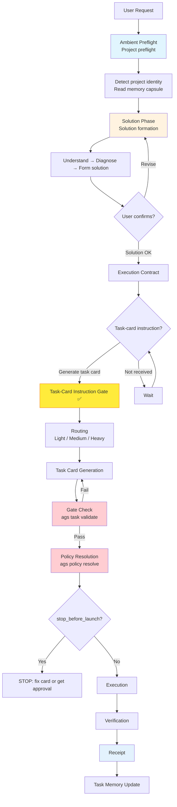

# Agent General Staff (AGS)

[](https://github.com/FernandeZ-hjm/Agent-General-Staff/actions/workflows/ci.yml)
[](LICENSE)
[](https://www.rust-lang.org/)
[]()

[中文](README.md) | [English](README.en.md)

**A security gate for a workforce of increasingly capable — and increasingly cheap — AI programmers.**

AGS is a local-first multi-agent engineering governance kernel. It compiles to a single Rust binary (no runtime dependencies) and uses task cards, execution policies, verification gates, and memory capsules to bring Codex, Claude Code, Cursor, and other AI agent frameworks under one verifiable, auditable engineering order.

It is not another agent, and it is not a bundle of tools. It solves the **governance problem** that shows up when several agents work on a real project together: who may do what, when an agent must stop, how tasks are handed off, how execution is verified, and how context survives across tasks.

## Table of Contents

- [Quick Start](#quick-start)
- [60-Second Demo](#60-second-demo)
- [Seven Gates](#seven-gates)
- [How It Works](#how-it-works)
- [Common Commands](#common-commands)
- [Why AGS](#why-ags)
- [Design Philosophy](#design-philosophy)
- [Verification](#verification)
- [Third-Party Skills](#third-party-skills)
- [Learn More](#learn-more)
- [License](#license)

## Quick Start

```bash
# Prerequisite: Rust toolchain
curl --proto '=https' --tlsv1.2 -sSf https://sh.rustup.rs | sh
source "$HOME/.cargo/env"

# Clone + install
git clone https://github.com/FernandeZ-hjm/Agent-General-Staff.git
cd Agent-General-Staff
bash scripts/install.sh
```

The install script builds `ags` and runs `ags setup --yes --force`, writing only public-safe local entries and MCP snippets. No third-party skills, no private runtime.

After installation:

```bash
ags doctor            # Check suite health
ags verify --scope local   # Local verification
```

<details>
<summary><strong>Build from source (no install script)</strong></summary>

**Linux / macOS:**

```bash
cargo build --release
export PATH="$PWD/target/release:$PATH"
ags verify --scope local
```

**Windows (PowerShell):**

```powershell
cargo build --release
$env:Path = "$PWD\target\release;$env:Path"
.\target\release\ags.exe verify --scope local
```

`scripts/install.sh` and `scripts/update.sh` are Bash convenience paths for Linux / macOS / WSL / Git Bash. On native Windows, use the Cargo + PowerShell path above.

</details>

<details>
<summary><strong>Update AGS</strong></summary>

```bash
# Check only; useful for a daily update check
bash scripts/update.sh --check --max-age-days 1

# Explicitly update: pull latest source, reinstall, run verification
bash scripts/update.sh --apply
```

If `ags --version` still shows an older version after updating, the shell is likely resolving an older binary first. Run `command -v ags` to see which binary is active. Both scripts report this path and warn when an older binary shadows the newly installed one.

</details>

## 60-Second Demo

```bash
# 1. Project preflight: the agent learns where it stands before touching anything
ags session preflight --for claude-code --target .

# 2. Validate a task card + resolve execution policy
bash scripts/validate.sh examples/task-cards/medium-demo-task.md
ags policy resolve examples/task-cards/medium-demo-task.md

# 3. Verify an execution receipt
ags receipt verify examples/receipts/sample-receipt.json
```

More examples at [examples/](examples/). Eval scenarios at [evals/](evals/).

## Seven Gates

AGS does not rely on a single feature to govern agents. It places a gate at seven points along the engineering pipeline. Each gate addresses a specific pothole that AI coding has repeatedly driven into.

### Task Card Governance

A task card is not a prompt. It is the engineering contract an agent signs before it touches anything — spelling out the goal, non-goals, permission mode, execution boundaries, verification method, and delivery format. With a contract in place, the agent cannot improvise from a single sentence.

### Execution Policy Resolution

An agent should not decide for itself what it may do. AGS resolves execution policy from the task card: read-only, plan-first, execute-and-verify, or stop for human confirmation. Policy first, execution second.

### Project Preflight

An agent gets a checkup before entering a project. `ags session preflight` reads project identity, protocol status, memory paths, stop conditions, verification commands, and missing-file warnings — no guessing.

### Verification Gate

Speak with verification results, not with the words "I finished." `ags verify` checks formatting, tests, builds, task-card fixtures, YAML, protocol status, and release boundaries, emitting results in a unified format that humans, agents, and CI can all read.

### Execution Receipt

Every run leaves a receipt you can trace. `ags receipt` records the task card, execution policy, verification results, exit code, and review-gate status. Not ceremony — it makes each agent execution something you can look back on.

### Skill Governance

Third-party skills can be recommended, never installed for you by default. `ags skill` provides a management console: `inventory` to audit on-disk skill assets, `verify` to check host visibility, `propose` for dry-run proposals, `adopt` / `ignore` for confirmed writes. Every change is recorded, confirmed, and bounded.

### Memory Capsule

Let experience escape the chat log and become a project asset. After each task, AGS saves task snapshots, key decisions, verification results, and context summaries. A later agent reads the project profile and task memory before continuing, instead of re-explaining the requirement from scratch. The larger the project, the longer the task chain, the more agents involved — the more this matters.

### Self-Check And Release Gate (2.6)

The repository ships a `deny.toml` (RustSec advisories + MIT/Apache-2.0/Unicode-3.0 license allowlist + crates.io-only sources), wired into CI and `scripts/verify.sh` with a fail-closed policy. In 2.6, verification moves closer to the change itself: `ags verify lane` and the lane-decision helper classify diffs into minimal / standard / full / release paths, while release verification keeps the public-full boundary free of private runtime files, machine-local paths, and build output.

## How It Works

AGS does not allow an agent to jump from a single user sentence straight into execution. The standard flow:

```text
Project preflight → solution formation → user confirmation → task card generation
  → execution policy resolution → gate check → execution → verification
  → receipt generation → task memory update
```

The most important part is not any single command, but the order. **Three-gate threshold:**

1. **Solution OK** — the user confirms the solution direction
2. **Task-card instruction** — the user explicitly asks for a task card ("Solution OK" ≠ "go")
3. **Task routing** — Light / Medium / Heavy, determining execution policy

Without the middle gate (task-card instruction), routing must not proceed.



For architectural details, see [docs/architecture.md](docs/architecture.md).

## Common Commands

| Command | Purpose |
|---|---|
| `ags setup` | Write local AGS runtime, MCP snippets, and agent entries |
| `ags init` | Integrate AGS managed blocks into a target project |
| `ags mcp serve` | Start the AGS MCP stdio server |
| `ags session preflight` | Project preflight (CLI fallback when MCP is unavailable) |
| `ags task validate` | Validate task-card format and semantics |
| `ags task compile` | Compile a task card from structured input |
| `ags policy resolve` | Resolve execution policy |
| `ags policy check` | Validate + resolve, output gate result |
| `ags gate` | Runner-facing gate decision (M3) |
| `ags verify` | Structured verification (local / full / release) |
| `ags doctor` | Suite health diagnostics; `--repair` for actionable fixes |
| `ags receipt` | Generate or verify execution receipts |
| `ags compliance` | Check task-execution compliance |
| `ags capability` | Capability discovery and registry (M5) |
| `ags hook` | Stop-archive hook management |
| `ags skill` | Skill management console (scan / check / inventory / verify / propose / adopt / ignore) |
| `ags sync check` | Multi-project protocol drift check |
| `ags bootstrap` | Bootstrap initialization (`--dry-run` / `--apply`) |

**Agent entries:** `/ags` is the Claude Code entry; `$ags-setup` / `$ags-init` / `$ags-skill` / `$ags-doctor` are Codex-visible entries. All AGS tasks must call the AGS MCP `ags_preflight` tool first, with the CLI as a fallback only.

## Why AGS

I used to think the biggest problem in AI coding was that models weren't smart enough. They are. The problem is the opposite: they're too smart, too eager, too willing to act.

Ask it to change one function, and it refactors half a module. Ask it for a read-only audit, and halfway through it wants to fix things for you. Say "this plan looks good," and it hears "go." Ask it to finish a task, and it tells you "done" — with no tests, no evidence, no record you can look back on.

Each of those potholes became a specific gate in AGS:

| The pothole I hit | The gate AGS grew |
|---|---|
| A read-only task escalated into editing code | Execution policy resolution + gate |
| "Done" — with nothing verified | Verification gate + execution receipt |
| Amnesia in a new chat, the same pothole hit twice | Memory capsule |
| Skills, hooks, and MCP configs polluting each other | Unified skill governance |

One level down, this is a control problem. A large model is a high-gain component that drifts. What engineering can do is not build a model that never errs, but wrap a loop around it: let it guess less, improvise less, and collaborate through task cards, protocols, verification, and memory. Model capability fluctuates; the engineering process carries the stability.

## Design Philosophy

<details>
<summary><strong>Origin: I just wanted to manage a few plugins</strong></summary>

I'm new to AI coding. Like a lot of people, I got hooked fast. Someone on social media shows off a killer skill, an MCP server, a hook, a pile of config files — and I want to install all of it. A code-review plugin today, a task-memory system tomorrow, an automation hook the day after, as if not installing it meant falling behind.

Then the plugins pile up, and the trouble starts. Who manages versions? How do I update a third-party skill without breaking a local setup that already works? Do the MCP servers, hooks, project rules, and agent configs fight each other? I only wanted a small script to keep my local plugins in order. A month later, it had become my first open-source project.

I later found out it collides, by name, with a Microsoft open-source project called [AGT (Agent Governance Toolkit)](https://github.com/microsoft/agent-governance-toolkit). AGT is a gate at execution time — it intercepts an agent's tool calls, API calls, and file operations before they land. AGS governs the whole engineering lifecycle of agent collaboration: preflight, solution, task card, execution policy, verification, receipt, memory. The names nearly collide, but what we'd really collided with was the same question of the era: as AI programmers get more capable, how do humans stay in control?

AGS wasn't designed at a whiteboard. It's more like a defense system my body grew after AI coding beat me up a few times in a row.

</details>

<details>
<summary><strong>The Five Articles</strong></summary>

Full walk-through in [docs/philosophy.en.md](docs/philosophy.en.md); here is the skeleton:

| Article | In one line | What it became in AGS |
|---|---|---|
| I · Don't trust a single AI | Codex, Claude Code, Cursor are all strong, but strong at different things | A shared engineering order for every agent |
| II · AI can't fully understand human speech | A prompt is chat language, not an engineering contract | The task card is the engineering contract |
| III · Execution is not a straight line | Sometimes brilliant, sometimes distracted | Keep the trail; errors must not happen quietly |
| IV · Human judgment deserves to be saved | The valuable thing isn't a model output, it's human judgment at the solution stage | The memory capsule |
| V · Mix your models | Top-tier models are expensive; cheap models left unsupervised are unstable | Top-tier models judge, cheaper models execute, AGS governs the whole run |

</details>

<details>
<summary><strong>An arc reactor for budget models</strong></summary>

Top-tier models are genuinely good, but expensive. Budget models are cheap; fully unsupervised, they drift. What AGS does is wrap the engineering process around the cheaper model: a clear task, clear boundaries, clear acceptance criteria. Top-tier models make the key calls, budget models do the bulk of the work, AGS keeps the whole run in line — and a stronger model sweeps for gaps after delivery.

On a single output, it won't turn a budget model into a top-tier one. But across a sustained multi-round engineering pipeline — with task-card constraints, verification gates, and execution receipts as backstops — a governed budget model delivers far more consistently than one running unconstrained. The gap widens with task-chain length.

Think of it as fitting a budget model with an arc reactor: a small core that lets a budget frame run with near-flagship endurance.

</details>

## Cross-Platform Support

AGS 2.6 continues to be verified on `ubuntu-latest`, `macos-latest`, and `windows-latest` in CI.

- The **Rust core** builds, tests, and runs across all three platforms. The `ags-platform` crate handles home-directory resolution and PATH lookups uniformly (Windows uses `USERPROFILE` + `PATHEXT`; no dependency on Unix `$HOME` or external `which`).
- **Bash scripts** (`scripts/*.sh`) target Linux / macOS / WSL / Git Bash and are not promised to run natively under Windows PowerShell or cmd.

## Verification

```bash
# Local verification: formatting, tests, builds, fixtures, YAML, preflight
ags verify --scope local

# Release-boundary verification: public manifest + tracked-source leak scan + bootstrap payload
ags verify --scope release

# Compatibility gate (equivalent to ags verify --scope local + command-surface smoke)
bash scripts/verify.sh
```

## Third-Party Skills

AGS can recommend third-party development skills, but it does not install them by default.

Third-party skills change agent behavior and may affect the local development environment. AGS treats them as recommendations that can be checked and recorded, but must be explicitly confirmed by the user. See `docs/skill-recommendations.md` for the curated list. Superpowers-related skills and their MIT License are documented in `THIRD_PARTY_NOTICES.md`.

## Learn More

- [docs/philosophy.en.md](docs/philosophy.en.md) — the five articles in depth, and the control-theory idea behind this engineering order
- [docs/architecture.md](docs/architecture.md) — AGS architecture: lifecycle, MCP initialization gate, crate dependency graph, execution pipeline, memory capsule mechanism
- [docs/comparison.md](docs/comparison.md) — AGS compared with other governance approaches
- [examples/](examples/) — Public-safe examples: demo project, task cards, sample outputs, synthetic receipts
- [evals/](evals/) — Reproducible experiment scenarios: authority escalation, unverified delivery, solution-as-execution
- [COMMERCIAL.md](COMMERCIAL.md) — Commercial use, attribution, and brand notes under the MIT License

## License

AGS (Agent General Staff, formerly Agent Governance Suite) uses the MIT License.

You may download, read, copy, modify, distribute, use commercially, and create derivative works from AGS. The required condition is preserving the MIT license text and copyright notice. `NOTICE.md` and `THIRD_PARTY_NOTICES.md` record project attribution and third-party materials and should be preserved when distributing AGS. The names "Agent General Staff" and "AGS" may be used for truthful attribution and compatibility statements, but they do not grant brand endorsement or trademark rights.

---

AGS is a security gate bolted onto an AI programmer — not to make it freer, but to make sure that when it walks into a real project, it knows the boundaries, leaves a record, accepts review, and carries what it learned into the next task.
