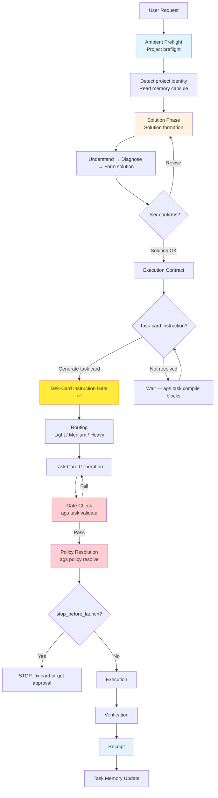

# Agent Governance Suite (AGS)

[中文](README.md) | [English](README.en.md)

**A governance-kernel CLI for multi-agent engineering workflows.**

AGS is a local-first multi-agent engineering governance CLI. It brings local `skills`, hooks, MCP, task memory, and different AI agent frameworks such as Codex, Claude Code, and Cursor into one verifiable, auditable, and continuously collaborative development system.

AGS is not a new agent, and it is not just a collection of tools. It solves the governance problem that appears when multiple agents participate in real project development: who is allowed to do what, when an agent must stop, how tasks are handed off, how execution is verified, and how context continues across tasks.

## Why AGS Is Needed

AI cannot understand and execute human intent with perfect fidelity. Even strong models drift in requirement interpretation, context selection, implementation details, and risk judgment. A single agent also tends to develop its own coding style and decision habits, so it naturally needs review, inspection, and verification from other agents or human developers.

In real projects, that drift becomes concrete. An agent may edit the wrong file, exceed its authority, skip verification, treat a solution discussion as an execution command, or expand task scope without confirmation.

AGS adds engineering boundaries before agent execution. Through task cards, permission policies, execution gates, stop conditions, and verification flows, it turns "what the AI wants to do" into "what the project allows it to do."

This has another practical value: it reduces the need for top-tier models to participate in every step of development.

Top-tier models matter, but real development should not put every phase on the most expensive model. Domestic models such as GLM, DeepSeek, and MiMo, combined with AGS task decomposition, execution boundaries, verification gates, and an engineering entry point such as Codex or Cursor, can approach much of the effect of high-end-model full-cycle development in many low- and medium-risk tasks at a lower cost.

The point is not to make ordinary models pretend to be top-tier models. The point is to put tasks into a clearer engineering structure. Models guess less, improvise less, and collaborate more through task cards, protocols, verification, and memory. Model capability will fluctuate; the engineering process has to carry part of the stability burden.

## The Core Problems AGS Solves

Local development environments often accumulate third-party GitHub skills, custom local skills, hooks, MCP configuration, and project rules. Different agent frameworks manage skills, configuration files, and project context in different ways.

As a result, the same development capability is easily split across multiple tools. Codex has one configuration, Claude Code has another, and Cursor has another set of rules. This raises maintenance cost, makes migration harder, and can pollute local environments.

AGS provides a unified skill-governance layer. It does not try to replace each agent framework. Instead, it centralizes skill recommendations, install confirmation, project rules, execution protocols, and safety boundaries. Users can update third-party skills incrementally while keeping their local customizations and existing development environment intact.

Another problem is task memory.

Most agent frameworks do not have a structured task-memory system. After a task ends, the execution process, key decisions, verification results, unfinished items, and risk notes are often scattered across chat history.

That is dangerous in large projects. Human developers have to track progress from memory, and a new agent often cannot tell what happened last time, why a decision was made, or which areas must not be touched.

AGS provides a memory-capsule mechanism. After each task, it can save task snapshots, delivery records, verification results, and context summaries. When a later agent enters the project, it can read the project profile and task memory before continuing development.

This turns multi-step development into a continuous engineering process instead of repeatedly re-explaining the same requirements.

## How AGS Works

The standard AGS workflow is:

```text
Project preflight
  → solution formation
  → user confirmation
  → task card generation
  → execution policy resolution
  → gate check
  → task execution
  → verification
  → receipt generation
  → task memory update
```

Visual flow:



The most important part is not any single command, but the order.

AGS does not allow an agent to jump directly from one user sentence into execution. It requires the agent to understand the project, form a solution, wait for user confirmation, and only then enter task-card and execution-policy flow.

**Three-gate threshold:** Solution OK → Task-card instruction → Task routing. Without the middle gate (task-card instruction), routing must not proceed. "Solution OK" does not mean execution is allowed. A task becomes executable only after the user explicitly asks for a task card.

For architectural details, see [docs/architecture.md](docs/architecture.md).

## Core Capabilities

### Task Card Governance

AGS uses task cards as the formal entry point for development tasks.

A task card is not a normal prompt. It must specify the goal, background, non-goals, permission mode, execution boundaries, verification method, and delivery format. Before execution, the agent is constrained by an explicit engineering contract.

### Execution Policy Resolution

AGS resolves execution policy from task-card content.

It decides whether a task should be read-only, plan-first, execute-and-verify, or stopped for human confirmation. An agent should not decide what it may do directly from the raw request. It must go through policy resolution before execution.

### Project Preflight

Before each task, AGS can run session preflight.

Preflight reads project identity, protocol status, memory paths, stop conditions, verification commands, and missing-file warnings. When an agent enters a repository, it does not need to guess what the repository is, whether it may edit, or which rules it should read first.

### Verification Gate

AGS includes a structured verification entry point.

It can check formatting, tests, builds, task-card fixtures, YAML, protocol status, and release boundaries. Verification results are emitted through a unified model that can be read by humans, agents, or CI.

AGS requires evidence from verification, not just an agent saying "I finished."

### Execution Receipt

After task execution, AGS can generate a receipt.

The receipt records the task card, execution policy, verification results, exit code, and review-gate status. It is not ceremony. It makes each agent execution traceable.

### Skill Governance

AGS does not install third-party skills by default. To provide a more complete engineering-collaboration experience, it may recommend selected GitHub development skill packs, but installation must be explicitly confirmed by the user.

It provides skill recommendation, scanning, checking, proposal, and confirmed-install flows. Users can selectively install or update skills to fit their local development style, instead of letting third-party skills rewrite the development environment directly.

The goal is not to absorb every skill into AGS. The goal is to make skill updates bounded, recorded, and confirmed.

### Memory Capsule

AGS provides protocols and templates for project profiles, context memory, task archives, and delivery records.

The memory capsule lives inside the user's own project and grows with the development process. It records task snapshots, key decisions, verification results, and delivery information, so later agents do not have to understand the project from scratch every time.

The larger the project, the longer the task chain, and the more agents participate, the more important accumulated memory becomes. It makes project progress traceable and reduces the need for multi-agent collaboration to rely entirely on the human developer's memory.

## Quick Start

```bash
git clone https://github.com/FernandeZ-hjm/agent-governance-suite.git
cd agent-governance-suite
bash scripts/install.sh
```

After installation:

```bash
ags doctor
ags verify --scope local
```

Update AGS:

```bash
# Check only; useful for a daily update check
bash scripts/update.sh --check --max-age-days 1

# Explicitly update: pull latest source, reinstall AGS, and run local verification
bash scripts/update.sh --apply
```

If `ags --version` still shows an older version after updating, the shell is
usually resolving an older binary first. Run:

```bash
command -v ags
```

to see which `ags` binary is active. Both `scripts/install.sh` and
`scripts/update.sh` report this path and warn when an older binary shadows the
newly installed one.

To build from source:

```bash
cargo build --release
export PATH="$PWD/target/release:$PATH"
```

### 60-Second Quick Demo

```bash
# 1. Project preflight
ags session preflight --for claude-code --target .

# 2. Validate a task card + resolve execution policy
bash scripts/validate.sh examples/task-cards/medium-demo-task.md
ags policy resolve examples/task-cards/medium-demo-task.md

# 3. Verify an execution receipt
ags receipt verify examples/receipts/sample-receipt.json
```

### Three-Stage Verifiable Experience

#### Step 1: Build from Source

```bash
cargo build --release
export PATH="$PWD/target/release:$PATH"
```

Verify the build:

```bash
ags doctor
ags verify --scope local
```

#### Step 2: Demo Dry-Run

Run preflight against the AGS repository, then validate built-in synthetic examples:

```bash
# Preflight against the AGS repository
ags session preflight --for claude-code --target .

# Validate an example task card
bash scripts/validate.sh examples/task-cards/light-demo-task.md

# Resolve execution policy
ags policy resolve examples/task-cards/light-demo-task.md
```

#### Step 3: Sample Task Card Verification

```bash
# Medium-level task card: gate → policy → receipt chain
bash scripts/validate.sh examples/task-cards/medium-demo-task.md
ags policy resolve examples/task-cards/medium-demo-task.md

# Verify a synthetic receipt
ags receipt verify examples/receipts/sample-receipt.json
```

More examples at [examples/](examples/). Eval scenarios at [evals/](evals/).

## Common Commands

| Command | Purpose |
|---|---|
| `ags session preflight` | Run project preflight before a task |
| `ags task validate` | Validate task-card format and semantics |
| `ags policy resolve` | Resolve execution policy |
| `ags policy check` | Validate a task card and output gate result |
| `ags verify` | Run structured verification |
| `ags doctor` | Check suite health |
| `ags receipt` | Generate or verify execution receipts |
| `ags compliance` | Check task-execution compliance |
| `ags skill` | Manage skill recommendations, scanning, and confirmed installs |

## Learn More

- [docs/architecture.md](docs/architecture.md) — AGS architecture: lifecycle, crate dependency graph, execution pipeline, memory capsule mechanism
- [examples/](examples/) — Public-safe examples: demo project, task cards, sample outputs, synthetic receipts
- [evals/](evals/) — Reproducible experiment scenarios: authority escalation, unverified delivery, solution-as-execution
- [COMMERCIAL.md](COMMERCIAL.md) — Commercial use boundaries and authorization requests (based on LICENSE, not expanding its legal scope)

## Verification

Local verification:

```bash
ags verify --scope local
```

Full verification:

```bash
ags verify --scope full
```

Release-boundary verification:

```bash
AGS_PUBLIC_ROOT="$PWD" ags verify --scope release
```

Compatibility gate:

```bash
bash scripts/verify.sh
```

## Third-Party Skills

AGS can recommend third-party development skills, but it does not install them by default.

Third-party skills change agent behavior and may affect the local development environment. AGS treats them as recommendations that can be checked and recorded, but must be explicitly confirmed by the user.

Superpowers-related skills and methodology are third-party work. AGS preserves attribution and documents the MIT License in `THIRD_PARTY_NOTICES.md`.

## License

AGS 2.0 Public Edition uses the `Agent Governance Suite Public License 2.0`.

You may download, read, modify, and use it for personal or internal company engineering work.

Without permission, you may not package AGS itself, a lightly modified AGS fork, or an AGS-compatible wrapper product as a paid product, subscription service, commercial template, plugin pack, or consulting deliverable.

AGS can be used to improve your own engineering efficiency, but it cannot be repackaged as another paid agent-governance product.
