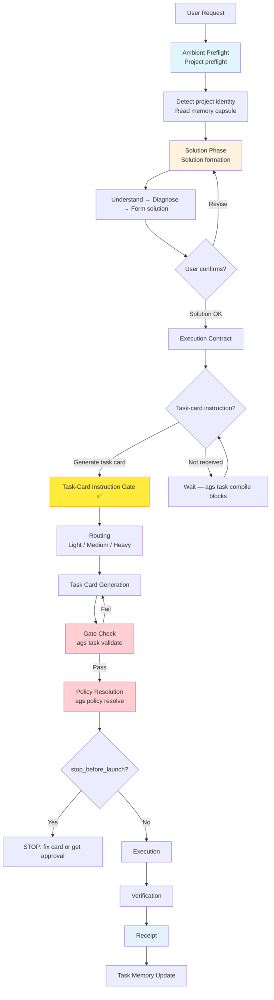

# Agent General Staff (AGS)

[](https://github.com/FernandeZ-hjm/Agent-General-Staff/actions/workflows/ci.yml)
[](LICENSE)

[中文](README.md) | [English](README.en.md)

**A security gate for a workforce of increasingly capable — and increasingly cheap — AI programmers.**

AGS (Agent General Staff) is a local-first multi-agent engineering governance kernel. It ships a Rust-native `ags` CLI, an `ags mcp serve` kernel bridge, a `/ags` entry for Claude Code, and Codex-visible command skills, bringing local `skills`, hooks, MCP, task memory, and different AI agent frameworks — Codex, Claude Code, Cursor — into one verifiable, auditable, continuously collaborative development system.

It is not another agent, and it is not a bundle of tools. It solves the governance problem that shows up when several agents work on a real project together: who may do what, when an agent must stop, how tasks are handed off, how execution is verified, and how context survives across tasks.

## Origin: I Just Wanted to Manage a Few Plugins

I'm new to AI coding. Like a lot of people, I got hooked fast. Someone on social media shows off a killer skill, an MCP server, a hook, a pile of config files — and I want to install all of it. A code-review plugin today, a task-memory system tomorrow, an automation hook the day after, as if not installing it meant falling behind.

Then the plugins pile up, and the trouble starts. Who manages versions? How do I update a third-party skill without breaking a local setup that already works? Do the MCP servers, hooks, project rules, and agent configs fight each other? Do they fire at the right moment, or does it all come down to the model's mood that day? I only wanted a small script to keep my local plugins in order. A month later, it had become my first open-source project: Agent General Staff, or AGS.

What makes it stranger: I later found out it collides, by name, with a Microsoft open-source project called AGT ([Agent Governance Toolkit](https://github.com/microsoft/agent-governance-toolkit)). I panicked for a second, then let it go. AGT is a gate at execution time — it intercepts an agent's tool calls, API calls, and file operations before they land. AGS governs the whole engineering lifecycle of agent collaboration: preflight, solution, task card, execution policy, verification, receipt, memory. The names nearly collide, but what we'd really collided with was the same question of the era: as AI programmers get more capable, how do humans stay in control?

So AGS wasn't designed at a whiteboard. It's more like a defense system my body grew after AI coding beat me up a few times in a row. Every beating, I added another gate. Stack the gates together, and you get AGS.

## Why AGS Exists

I used to think the biggest problem in AI coding was that models weren't smart enough. They are. The problem is the opposite: they're too smart, too eager, too willing to act.

Ask it to change one function, and it refactors half a module. Ask it for a read-only audit, and halfway through it wants to fix things for you. Say "this plan looks good," and it hears "go." Ask it to finish a task, and it tells you "done" — with no tests, no evidence, no record you can look back on. It's not that it can't do the work. It does the work too well, well enough to make you nervous.

Each of those potholes became a specific gate in AGS:

| The pothole I hit | The gate AGS grew |
|---|---|
| A read-only task escalated into editing code | Execution policy resolution + gate |
| "Done" — with nothing verified | Verification gate + execution receipt |
| Amnesia in a new chat, the same pothole hit twice | Memory capsule |
| Skills, hooks, and MCP configs polluting each other | Unified skill governance |

One level down, this is a control problem. A large model is a high-gain component that drifts — capable one moment, off the next, and you can't make it stop drifting. What engineering can do is not build a model that never errs, but wrap a loop around it: let it guess less, improvise less, and collaborate through task cards, protocols, verification, and memory. Model capability fluctuates; the engineering process carries the stability.

And the rule that matters most: AGS does not let an agent jump from a single user sentence straight into execution. **"Solution OK" does not mean "go."** A task becomes executable only when the user explicitly asks for a task card. No task card, no clear permission, no verification method, no stop condition — the agent touches nothing.

## The Five Articles

This past month, the open-source community and the model labs shipped non-stop. AGS wasn't invented in a vacuum — it's five articles I settled into while learning from the community and getting schooled by my own project in real time. Full walk-through in [docs/philosophy.en.md](docs/philosophy.en.md); here is the skeleton:

| Article | In one line | What it became in AGS |
|---|---|---|
| I · Don't trust a single AI or a single tool | Codex, Claude Code, Gemini CLI, Cursor are all strong, but strong at different things, with different habits | A shared engineering order for every agent: who plans, who executes, who reviews, who may touch files, who is read-only, when to stop |
| II · AI can't fully understand human speech | A prompt is chat language, not an engineering contract — and Chinese is especially slippery | A prompt is chat language; the task card is the engineering contract |
| III · Execution is not a straight line | Sometimes brilliant, sometimes distracted, sometimes confidently wrong | Keep the trail; the goal isn't a model that never errs, but errors that never happen quietly |
| IV · Human judgment deserves to be saved | The valuable thing isn't a single model output, it's human judgment at the solution and architecture stage | The memory capsule — let experience escape the chat log and become a project asset |
| V · Mix your models, work without fatigue | Top-tier models are expensive; cheap models left unsupervised are unstable | Top-tier models judge, cheaper models execute, AGS governs the whole run |

## How AGS Works

The standard AGS workflow is:

```text
Project preflight
  → solution formation
  → user confirmation
  → task card generation
  → execution policy resolution
  → gate check
  → task execution
  → verification
  → receipt generation
  → task memory update
```

Visual flow:



The most important part is not any single command, but the order. AGS does not allow an agent to jump directly from one user sentence into execution. It requires the agent to understand the project, form a solution, wait for user confirmation, and only then enter the task-card and execution-policy flow.

**Three-gate threshold:** Solution OK → Task-card instruction → Task routing. Without the middle gate (task-card instruction), routing must not proceed. "Solution OK" does not mean execution is allowed. A task becomes executable only after the user explicitly asks for a task card.

For architectural details, see [docs/architecture.md](docs/architecture.md).

## Core Capabilities

### Task Card Governance

A task card is not a normal prompt — it's the engineering contract an agent signs before it touches anything. It spells out the goal, background, non-goals, permission mode, execution boundaries, verification method, and delivery format, constraining the agent inside an explicit contract instead of letting it improvise from one sentence.

### Execution Policy Resolution

An agent shouldn't decide for itself what it may do. AGS resolves execution policy from the task card — read-only, plan-first, execute-and-verify, or stop for human confirmation. Policy first, execution second.

### Project Preflight

An agent should know where it stands before it walks in. Before each task, AGS can run session preflight, reading project identity, protocol status, memory paths, stop conditions, verification commands, and missing-file warnings — no guessing.

### Verification Gate

Speak with verification results, not with the words "I finished." AGS includes a structured verification entry point that checks formatting, tests, builds, task-card fixtures, YAML, protocol status, and release boundaries, emitting results through a unified model that humans, agents, and CI can all read.

### Execution Receipt

Every run leaves a receipt you can trace. It records the task card, execution policy, verification results, exit code, and review-gate status. Not ceremony — it makes each agent execution something you can look back on.

### Skill Governance

Third-party skills can be recommended, never installed for you by default. AGS provides recommendation, scanning, checking, proposal, and confirmed-install flows. Its stance: recommend, check, record — but every install is explicitly confirmed by the user, so skill updates stay bounded, recorded, and confirmed.

### Memory Capsule

Let experience escape the chat log and become a project asset. After each task, AGS can save task snapshots, key decisions, verification results, and context summaries. A later agent reads the project profile and task memory before continuing, instead of re-explaining the requirement from scratch every round. The larger the project, the longer the task chain, the more agents involved — the more this matters.

## The "Arc Reactor" for Domestic Models

Top-tier foreign models are genuinely good, but expensive. Domestic models are cheap and plentiful, but unstable when fully unsupervised. What AGS does is wrap the engineering process around the cheaper model: a clear task, clear boundaries, clear acceptance criteria. Top-tier models make the key calls, cheaper models do the bulk of the concrete work, AGS keeps the whole run in line — and a stronger model sweeps for gaps after delivery.

This isn't frugality for its own sake. Model capability fluctuates — that's the nature of the component under control; the engineering answer is not a part that never fails, but a loop that lets an unreliable part deliver reliable results. AGS is that loop. On a single output, it won't turn a domestic model into a top-tier one; but in real engineering, it can reach roughly seventy to eighty percent of top-tier full-cycle development at something like a tenth of the all-foreign-model cost.

Put more vividly: it's like fitting a domestic model with an arc reactor — a small core that lets a budget frame run with near-flagship endurance. As more platforms tighten quotas, the future is mixed collaboration between top-tier and budget models. Whoever can fold cheap models into a stable engineering process turns AI coding from a parlor trick into productivity.

## Quick Start

```bash
git clone https://github.com/FernandeZ-hjm/Agent-General-Staff.git
cd Agent-General-Staff
bash scripts/install.sh
```

The install script installs `ags` and then runs `ags setup --yes --force`. That step writes only public-safe local entries and MCP snippets — no third-party skills, no private runtime.

After installation:

```bash
/ags setup
/ags init
ags mcp serve --transport stdio
ags doctor
ags verify --scope local
```

`/ags` is the Claude Code entry; the Codex-visible counterparts are `$ags-setup`, `$ags-init`, `$ags-skill`, `$ags-doctor`. Their shared rule: any AGS task must call the AGS MCP `ags_preflight` tool first, with the CLI as a fallback only.

Update AGS:

```bash
# Check only; useful for a daily update check
bash scripts/update.sh --check --max-age-days 1

# Explicitly update: pull latest source, reinstall AGS, and run local verification
bash scripts/update.sh --apply
```

If `ags --version` still shows an older version after updating, the shell is usually resolving an older binary first. Run `command -v ags` to see which `ags` binary is active. Both `scripts/install.sh` and `scripts/update.sh` report this path and warn when an older binary shadows the newly installed one.

To build from source:

```bash
cargo build --release
export PATH="$PWD/target/release:$PATH"
```

### 60-Second Quick Demo

```bash
# 1. Project preflight
ags session preflight --for claude-code --target .

# 2. Validate a task card + resolve execution policy
bash scripts/validate.sh examples/task-cards/medium-demo-task.md
ags policy resolve examples/task-cards/medium-demo-task.md

# 3. Verify an execution receipt
ags receipt verify examples/receipts/sample-receipt.json
```

### Three-Stage Verifiable Experience

```bash
# Step 1: build from source and verify
cargo build --release
export PATH="$PWD/target/release:$PATH"
ags doctor
ags verify --scope local

# Step 2: preflight against the repo root, then validate built-in samples
ags session preflight --for claude-code --target .
bash scripts/validate.sh examples/task-cards/light-demo-task.md
ags policy resolve examples/task-cards/light-demo-task.md

# Step 3: walk the gate → policy → receipt chain with a Medium task card
bash scripts/validate.sh examples/task-cards/medium-demo-task.md
ags policy resolve examples/task-cards/medium-demo-task.md
ags receipt verify examples/receipts/sample-receipt.json
```

More examples at [examples/](examples/). Eval scenarios at [evals/](evals/).

## Common Commands

| Command | Purpose |
|---|---|
| `ags setup` | Write public-safe local AGS runtime, MCP snippets, and agent entries |
| `/ags setup` | Claude Code entry; still requires AGS MCP preflight first |
| `$ags-setup` / `$ags-init` | Codex-visible entry skills; require calling AGS MCP `ags_preflight` first |
| `ags init` | Integrate AGS managed blocks into a target project |
| `ags mcp serve` | Start the AGS MCP stdio server |
| `ags session preflight` | Run project preflight before a task |
| `ags task validate` | Validate task-card format and semantics |
| `ags policy resolve` | Resolve execution policy |
| `ags policy check` | Validate a task card and output gate result |
| `ags verify` | Run structured verification |
| `ags doctor` | Check suite health |
| `ags receipt` | Generate or verify execution receipts |
| `ags compliance` | Check task-execution compliance |
| `ags skill` | Manage skill recommendations, scanning, and confirmed installs |

## Learn More

- [docs/philosophy.en.md](docs/philosophy.en.md) — the five articles in depth, and the control-theory idea behind this engineering order
- [docs/architecture.md](docs/architecture.md) — AGS architecture: lifecycle, crate dependency graph, execution pipeline, memory capsule mechanism
- [examples/](examples/) — Public-safe examples: demo project, task cards, sample outputs, synthetic receipts
- [evals/](evals/) — Reproducible experiment scenarios: authority escalation, unverified delivery, solution-as-execution
- [COMMERCIAL.md](COMMERCIAL.md) — Commercial use, attribution, and brand notes under the MIT License

## Verification

```bash
# Local verification
ags verify --scope local

# Full verification
ags verify --scope full

# Release-boundary verification
AGS_PUBLIC_ROOT="$PWD" ags verify --scope release

# Compatibility gate
bash scripts/verify.sh
```

## Third-Party Skills

AGS can recommend third-party development skills, but it does not install them by default.

Third-party skills change agent behavior and may affect the local development environment. AGS treats them as recommendations that can be checked and recorded, but must be explicitly confirmed by the user. Superpowers-related skills and methodology are third-party work; AGS preserves attribution and documents the MIT License in `THIRD_PARTY_NOTICES.md`.

## License

AGS (Agent General Staff, formerly Agent Governance Suite) uses the MIT License.

You may download, read, copy, modify, distribute, use commercially, and create derivative works from AGS. The required condition is preserving the MIT license text and copyright notice. `NOTICE.md` and `THIRD_PARTY_NOTICES.md` record project attribution and third-party materials and should be preserved when distributing AGS. The names "Agent General Staff" and "AGS" may be used for truthful attribution and compatibility statements, but they do not grant brand endorsement or trademark rights.

---

I used to think vibe coding meant stating a requirement and waiting for the AI to build it. I don't anymore. What it really tests isn't whether you can write prompts — it's whether you can turn your own judgment, boundaries, authorizations, acceptance criteria, and experience into an engineering order an agent can inherit.

In the end, AGS is a security gate bolted onto an AI programmer — not to make it freer, but to make sure that when it walks into a real project, it knows the boundaries, leaves a record, accepts review, and carries what it learned into the next task.

It's not a tool I wrote for the AI. It's more that the AI pushed me to learn how to be a better engineering lead.
