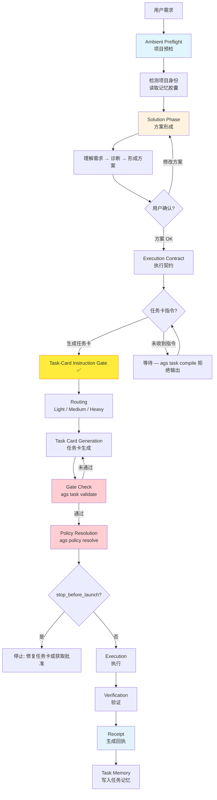

# Agent General Staff (AGS)

[](https://github.com/FernandeZ-hjm/Agent-General-Staff/actions/workflows/ci.yml)
[](LICENSE)

[中文](README.md) | [English](README.en.md)

**给一群越来越能干、越来越便宜的 AI 程序员，装一道工程安检门。**

AGS（Agent General Staff，智能体总参谋部）是一套面向本地开发环境的多 Agent 工程治理内核。它提供 Rust-native 的 `ags` CLI、`ags mcp serve` 内核桥、Claude Code 的 `/ags` 入口，以及 Codex 可见的命令技能，把本地 `skills`、hooks、MCP、任务记忆，以及 Codex、Claude Code、Cursor 等不同 AI Agent 框架，纳入同一套可验证、可审计、可持续协作的开发体系。

它不是又一个 Agent，也不是一堆工具的合订本。它解决的是多个 Agent 一起进真实项目时的治理问题：谁可以做什么，什么时候必须停，任务怎么交接，执行怎么验证，上下文怎么延续。

## 起源：我只是想管几个插件

我是个 AI 编程新手。跟很多人一样，刚上手那阵特别容易上头——社交网络上有人晒神级技能、MCP、钩子、各种配置文件，我看见就想装。今天一个代码审查插件，明天一个任务记忆系统，后天一个自动化钩子，不装好像就落后了。

插件一多，问题就来了。谁来管版本？第三方技能怎么更新，才不会破坏我本地已经跑通的环境？MCP、钩子、项目规则、智能体配置会不会互相打架？它们到底会不会在正确的时候触发，还是说，最后依然要看模型当天心情？我本来只想写个小脚本，把这些本地插件管起来。一个月后，它变成了我的第一个开源项目：Agent General Staff，简称 AGS。

更离谱的是，后来我发现它和微软一个叫 AGT（[Agent Governance Toolkit](https://github.com/microsoft/agent-governance-toolkit)）的开源项目撞了名。我慌了一下，很快释然：AGT 管的是 Agent 执行时的策略闸门，在工具调用、API、文件操作落地前做拦截；AGS 管的是 Agent 工程协作的整条生命周期——预检、方案、任务卡、执行策略、验证、回执、记忆。名字撞得近，但我们其实撞到了同一个时代命题：AI 程序员越来越能干，人类到底怎么管。

所以 AGS 不是我拍脑袋设计出来的。它更像是我被 AI 编程连续打了几顿之后，身体自己长出来的一套防御系统。每被毒打一回，我就多加一道闸门；最后这些闸门拼起来，成了 AGS。

## 为什么需要 AGS

我一开始以为，AI 编程最大的问题是模型不够聪明。后来发现不是。问题是它太聪明、太勤快、太敢干。

你让它改一个函数，它顺手重构半个模块。你让它做只读审计，它看着看着就想帮你修。你说"这个方案可以"，它理解成"那我开工了"。你让它完成任务，它告诉你"完成了"，但没有测试、没有证据，也没有一份能回看的记录。它不是不会干，它是太会干，干到你心里发毛。

这些坑后来都变成了 AGS 里的具体闸门：

| 我踩过的坑 | AGS 长出的闸门 |
|---|---|
| 只读任务被越权改成改代码 | 执行策略解析 + 门禁 |
| 说"完成了"却没有验证 | 验证门禁 + 执行回执 |
| 换个对话就失忆，同一个坑再踩一遍 | 记忆胶囊 |
| 技能、钩子、MCP 配置互相污染 | 统一技能治理 |

往更底层看，这是个控制问题。大模型是一个高增益但会漂移的元件，能力时好时坏，你没法让它不漂移。工程能做的，不是造一个永不出错的模型，而是在它外面套一道回路：让它少猜一点、少自由发挥一点，多按任务卡、协议、验证和记忆来协作。模型能力会波动，工程流程负责兜底。

最关键的一条规矩：AGS 不允许智能体从用户的一句话直接跳到执行。**方案 OK，不等于可以开工。** 只有用户明确要求生成任务卡，任务才进入可执行阶段。没有任务卡，没有明确权限，没有验证方式，没有停止条件，智能体就不应该动手。

## 五条宪章

这一个月，开源社区和模型公司都在疯狂更新。AGS 不是闭门造车，是我一边学社区经验、一边被自己的项目现场反复教育，沉淀出来的五条智能体宪章。详解见 [docs/philosophy.md](docs/philosophy.md)，这里给骨架：

| 宪章 | 一句话 | 在 AGS 里变成了 |
|---|---|---|
| 一·不迷信单一 AI、单一工具 | Codex、Claude Code、Gemini CLI、Cursor 都强，但强的地方不一样，惯性也不一样 | 给所有 Agent 一套共同工程秩序：谁规划、谁执行、谁审查、谁能动文件、谁只能只读、何时必须停 |
| 二·AI 听不全人话 | 提示词本质是聊天语言，不是工程合同，中文尤其复杂 | 提示词是聊天语言，任务卡才是工程合同 |
| 三·执行不是一条直线 | 它有时天才，有时走神，有时一本正经地胡说 | 留下过程；目标不是让 AI 永不犯错，而是让错误不要悄悄发生 |
| 四·高光判断该被沉淀 | 宝贵的不是某一次模型输出，是人在方案和架构阶段的判断 | 记忆胶囊，让经验从聊天里逃出来，变成项目资产 |
| 五·模型搭配，干活不累 | 顶级模型贵，平价模型放飞又不稳 | 顶级模型做判断，平价模型做执行，AGS 管住全程 |

## AGS 如何工作

AGS 的标准工作流是：

```text
项目预检
  → 方案形成
  → 用户确认
  → 生成任务卡
  → 执行策略解析
  → Gate 检查
  → 执行任务
  → 验证
  → 生成回执
  → 写入任务记忆
```

可视化流程：



这里最重要的不是某一个命令，而是顺序。AGS 不允许 Agent 从用户的一句话直接跳到执行。它要求先理解项目，再形成方案，再由用户确认，再进入任务卡和执行策略。

**三段门槛：** 方案 OK → 任务卡指令 → 任务分级路由。缺少中间的任务卡指令，不得进入路由。"方案 OK"不等于可以执行。只有用户明确要求生成任务卡，才进入可执行任务阶段。

架构详情见 [docs/architecture.md](docs/architecture.md)。

## 核心能力

### 任务卡治理

任务卡不是普通 prompt，它是 Agent 动手前必须先签的工程合同。它写清楚目标、背景、非目标、权限模式、执行边界、验证方式和交付格式，把 Agent 约束在一个明确的契约里，而不是任它从一句话里自由发挥。

### 执行策略解析

Agent 不该自己决定能做什么。AGS 根据任务卡解析执行策略，判断这次任务是只读、计划优先、执行并验证，还是必须先停下来等人工确认。策略先行，执行在后。

### 项目预检

Agent 进项目前，先知道自己在哪。每次任务开始前，AGS 可以执行 session preflight，读取项目身份、协议状态、记忆路径、停止条件、验证命令和缺口提示——不靠猜。

### 验证门禁

用验证结果说话，不接受口头"我完成了"。AGS 内置结构化验证入口，可以检查格式、测试、构建、任务卡 fixture、YAML、协议状态和发布边界，结果以统一模型输出，人能看，Agent 和 CI 也能读。

### 执行回执

每一次执行都留一张可追溯的回执。Receipt 记录任务卡、执行策略、验证结果、退出码和 review gate 状态。它不是为了增加仪式感，而是为了让每次 Agent 执行都能被回看。

### 技能治理

第三方技能可以推荐，但不替你默认安装。AGS 提供技能推荐、扫描、检查、提案和确认式安装能力。它的态度是：可以推荐，可以检查，可以记录，但必须由用户显式确认——让技能更新有边界、有记录、有确认。

### 记忆胶囊

让经验从聊天里逃出来，变成项目资产。每次任务后，AGS 可以保存任务快照、关键判断、验证结果和上下文摘要。后续 Agent 进项目时，先读项目画像和任务记忆，再继续开发，而不是每轮都从零重新解释需求。项目越大、任务越长、参与的 Agent 越多，这件事越值钱。

## 国产模型的"方舟反应炉"

国外顶级模型确实好用，但贵。国产模型便宜大碗，完全放飞又容易不稳。AGS 做的，是给平价模型套上工程流程：明确任务、明确边界、明确验收。顶级模型负责关键判断，平价模型负责大量具体执行，AGS 负责把整个过程管住，交付之后再让更强的模型查漏补缺。

这不是为省钱而省钱。模型能力会波动，这是被控对象的天性；工程的答案不是造一个永不出错的元件，而是用一个确定的回路，让不确定的元件交付稳定结果。AGS 就是那道回路——单看一次输出，它不能让国产模型变成顶级模型；但在真实工程里，它能用全程国外模型十几分之一的成本，做到顶级模型七八成的开发实效。

说得形象点，像给国产模型装了一个方舟反应炉：核心不大，却能让平价的机体迸发出接近顶配的续航。尤其在很多平台都在收紧额度的当下，未来一定是顶级模型和平价模型混合协作——谁能把便宜模型稳定地纳入工程流程，谁就能把 AI 编程从炫技变成生产力。

## 快速开始

```bash
git clone https://github.com/FernandeZ-hjm/Agent-General-Staff.git
cd Agent-General-Staff
bash scripts/install.sh
```

安装脚本会安装 `ags`，然后执行 `ags setup --yes --force`。这一步只写入公开安全的本机入口和 MCP 片段，不会安装第三方技能，也不会引入任何私有运行时。

安装后可以使用：

```bash
/ags setup
/ags init
ags mcp serve --transport stdio
ags doctor
ags verify --scope local
```

`/ags` 是 Claude Code 的公开入口；Codex 中对应的可见入口是 `$ags-setup`、`$ags-init`、`$ags-skill`、`$ags-doctor`。这些入口的共同约束是：凡是 AGS 相关任务，都必须优先通过 AGS MCP 显式调用 `ags_preflight`，CLI 只作为 MCP 不可用时的降级路径。

更新 AGS：

```bash
# 只检查，不安装；适合每天运行一次
bash scripts/update.sh --check --max-age-days 1

# 显式更新：拉取最新源码，重装 AGS，并运行本地验证
bash scripts/update.sh --apply
```

如果更新后 `ags --version` 仍显示旧版本，通常是 PATH 命中了旧二进制。运行 `command -v ags` 确认当前 shell 实际调用的是哪个 `ags`。`scripts/install.sh` 和 `scripts/update.sh` 都会在结束时报告这个路径，并在旧二进制抢占 PATH 时给出修复提示。

如果只想从源码构建：

```bash
cargo build --release
export PATH="$PWD/target/release:$PATH"
```

### 60 秒快速演示

```bash
# 1. 项目预检
ags session preflight --for claude-code --target .

# 2. 校验任务卡 + 解析执行策略
bash scripts/validate.sh examples/task-cards/medium-demo-task.md
ags policy resolve examples/task-cards/medium-demo-task.md

# 3. 校验执行回执
ags receipt verify examples/receipts/sample-receipt.json
```

### 三步可验证体验

```bash
# 第一步：源码构建并验证
cargo build --release
export PATH="$PWD/target/release:$PATH"
ags doctor
ags verify --scope local

# 第二步：对仓库根目录预检，再用内置样例跑 task validate
ags session preflight --for claude-code --target .
bash scripts/validate.sh examples/task-cards/light-demo-task.md
ags policy resolve examples/task-cards/light-demo-task.md

# 第三步：用 Medium 级任务卡体验 gate → policy → receipt 链路
bash scripts/validate.sh examples/task-cards/medium-demo-task.md
ags policy resolve examples/task-cards/medium-demo-task.md
ags receipt verify examples/receipts/sample-receipt.json
```

更多样例见 [examples/](examples/)，实验场景见 [evals/](evals/)。

## 常用命令

| 命令 | 作用 |
|---|---|
| `ags setup` | 写入公开安全的本机 AGS runtime、MCP 片段和 Agent 入口 |
| `/ags setup` | Claude Code 公开入口，内部仍要求 AGS MCP 预检优先 |
| `$ags-setup` / `$ags-init` | Codex 可见入口技能，要求先调用 AGS MCP `ags_preflight` |
| `ags init` | 对用户项目执行 AGS managed-block 接入 |
| `ags mcp serve` | 启动 AGS MCP stdio 服务 |
| `ags session preflight` | 执行任务前项目预检 |
| `ags task validate` | 校验任务卡格式与语义 |
| `ags policy resolve` | 解析任务执行策略 |
| `ags policy check` | 校验任务卡并输出 gate 结果 |
| `ags verify` | 执行结构化验证 |
| `ags doctor` | 检查套件健康状态 |
| `ags receipt` | 生成或校验执行回执 |
| `ags compliance` | 检查任务执行合规性 |
| `ags skill` | 管理技能推荐、扫描和确认式安装 |

## 了解更多

- [docs/philosophy.md](docs/philosophy.md) — 五条宪章详解，以及这套工程秩序背后的控制论思路
- [docs/architecture.md](docs/architecture.md) — AGS 架构：生命周期、crate 依赖图、执行链路、记忆胶囊机制
- [examples/](examples/) — 公开安全样例：demo 项目、任务卡、输出样例、合成 receipt
- [evals/](evals/) — 可复现评估实验：越权拦截、无验证交付、方案即执行三大风险场景
- [COMMERCIAL.md](COMMERCIAL.md) — MIT 许可证下的商业使用、署名和品牌说明

## 验证

```bash
# 本地验证
ags verify --scope local

# 完整验证
ags verify --scope full

# 发布边界验证
AGS_PUBLIC_ROOT="$PWD" ags verify --scope release

# 兼容总闸
bash scripts/verify.sh
```

## 第三方技能

AGS 可以推荐第三方开发技能，但不会默认安装它们。

第三方技能会改变 Agent 的行为方式，也可能影响本地开发环境。AGS 的态度是：可以推荐，可以检查，可以记录，但必须由用户显式确认。Superpowers 相关技能和方法论属于第三方项目，AGS 对相关来源保留署名，并在 `THIRD_PARTY_NOTICES.md` 中说明其 MIT License。

## 许可证

AGS（Agent General Staff，原名 Agent Governance Suite）使用 MIT License。

你可以下载、阅读、复制、修改、分发、商用，也可以基于它创建衍生作品。唯一硬性要求是保留 MIT 许可证文本和版权声明。`NOTICE.md` 和 `THIRD_PARTY_NOTICES.md` 记录项目署名和第三方材料来源，分发时也应保留。"Agent General Staff" 和 "AGS" 名称可用于真实署名和兼容性说明，但不代表授予品牌背书或商标授权。

---

我以前以为，氛围编程就是把需求说出来，然后等 AI 帮我实现。现在我不这么想了。它真正考验人的，不是会不会写提示词，而是你能不能把自己的判断、边界、授权、验收和经验，变成一套可以被智能体继承的工程秩序。

说到底，AGS 是给 AI 程序员装的一道安检门——不是为了让它更自由，而是为了让它进真实项目时知道边界、留下记录、接受验收，把经验带到下一次任务。

它不是我写给 AI 的工具。更像是 AI 反过来逼我，学会怎么当一个更好的工程负责人。
