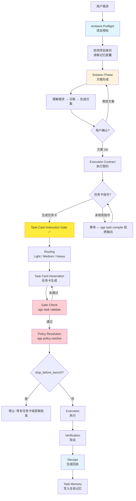

# Agent Governance Suite (AGS)

[中文](README.md) | [English](README.en.md)

**多 Agent 工程化治理内核 CLI。**

AGS 是一套面向本地开发环境的多 Agent 工程治理 CLI。它把本地 `skills`、hooks、MCP、任务记忆，以及 Codex、Claude Code、Cursor 等不同 AI Agent 框架，纳入同一套可验证、可审计、可持续协作的开发体系。

AGS 不是新的 Agent，也不是简单的工具集合。它解决的是多 Agent 参与真实项目开发时的治理问题：谁可以做什么，什么时候必须停下，任务如何交接，执行如何验证，上下文如何延续。

## 为什么需要 AGS

AI 不能百分百理解并执行人类需求。即使模型足够强，也会在需求理解、上下文取舍、执行细节和风险判断上产生偏差。单个 Agent 也会形成自己的代码风格和判断惯性，它天然需要其他 Agent 或人类开发者进行 review、审查和验证。

在真实项目里，这种偏差会变成具体问题。Agent 可能改错文件，越过权限，跳过验证，把方案讨论当成执行指令，或者在没有确认的情况下扩大任务范围。

AGS 的作用，是在 Agent 执行前加入工程边界。它通过任务卡、权限策略、执行门禁、停止条件和验证流程，把“AI 想怎么做”约束为“项目允许它怎么做”。

这件事还有一个现实意义：降低对顶级模型全程参与的依赖。

顶级模型当然重要，但真实开发不应该把所有环节都押在最贵的模型上。GLM、DeepSeek、MiMo 等国产模型，配合 AGS 的任务拆解、执行边界和验证门禁，再搭配 Codex 或 Cursor 这样的工程入口，在很多中低风险开发任务中，可以用更低成本接近高阶模型全程开发的大部分效果。

这里的关键不是让普通模型假装成顶级模型，而是把任务放进更清楚的工程结构里。模型少猜一点，少自由发挥一点，多按任务卡、协议、验证和记忆来协作。模型能力会波动，工程流程要负责兜底。

## AGS 解决的核心问题

本地开发环境通常会积累大量第三方 GitHub 技能、本地自定义技能、hooks、MCP 配置和项目规则。不同 Agent 框架对技能、配置文件和项目上下文的管理方式并不一致。

结果是，同一套开发能力很容易被拆散在多个工具里。Codex 有一套配置，Claude Code 有一套配置，Cursor 又有另一套规则。维护成本高，迁移困难，也容易互相污染。

AGS 提供统一的技能治理层。它不强行替代各个 Agent 框架，而是把技能推荐、安装确认、项目规则、执行协议和安全边界集中管理。用户可以按自己的节奏增量更新第三方技能，也可以保留自己的本地定制能力，而不破坏已有开发环境。

另一个问题是任务记忆。

多数 Agent 框架没有成体系的任务记忆。一次任务结束后，执行过程、关键判断、验证结果、未完成事项和风险说明，往往散落在聊天记录里。

这对大型项目很危险。人类开发者需要靠记忆追踪进度，新的 Agent 也很难知道上一次到底做了什么、为什么这么做、哪些地方不能碰。

AGS 提供记忆胶囊机制。每次任务后，它可以保存任务快照、交付记录、验证结果和上下文摘要。后续 Agent 进入项目时，可以先读取项目画像和任务记忆，再继续开发。

这让多步骤开发变成可延续的工程过程，而不是一轮一轮重新解释需求。

## AGS 如何工作

AGS 的标准工作流是：

```text
项目预检
  → 方案形成
  → 用户确认
  → 生成任务卡
  → 执行策略解析
  → Gate 检查
  → 执行任务
  → 验证
  → 生成回执
  → 写入任务记忆
```

可视化流程：



这里最重要的不是某一个命令，而是顺序。

AGS 不允许 Agent 从用户的一句话直接跳到执行。它要求先理解项目，再形成方案，再由用户确认，再进入任务卡和执行策略。

**三段门槛：** 方案 OK → 任务卡指令 → 任务分级路由。缺少中间的任务卡指令，不得进入路由。“方案 OK”不等于可以执行。只有用户明确要求生成任务卡，才进入可执行任务阶段。

架构详情见 [docs/architecture.md](docs/architecture.md)。

## 核心能力

### 任务卡治理

AGS 使用任务卡作为开发任务的正式入口。

任务卡不是普通 prompt。它必须写清楚目标、背景、非目标、权限模式、执行边界、验证方式和交付格式。这样 Agent 在执行前，先被约束在一个明确的工程契约里。

### 执行策略解析

AGS 会根据任务卡内容解析执行策略。

它会判断任务应该是只读、计划优先、执行并验证，还是必须先停下来等待人工确认。Agent 不应该直接从原始需求里决定自己能做什么，它必须先经过策略解析，再进入执行。

### 项目预检

每次任务开始前，AGS 可以执行 session preflight。

预检会读取项目身份、协议状态、记忆路径、停止条件、验证命令和缺口提示。Agent 进入项目后，不需要靠猜测判断当前仓库是什么、能不能改、应该先看哪些规则。

### 验证门禁

AGS 内置结构化验证入口。

它可以检查格式、测试、构建、任务卡 fixture、YAML、协议状态和发布边界。验证结果以统一模型输出，既能给人看，也能给 Agent 或 CI 读取。

AGS 要求用验证结果说话，而不是让 Agent 只说“我完成了”。

### 执行回执

任务执行结束后，AGS 可以生成 receipt。

Receipt 记录任务卡、执行策略、验证结果、退出码和 review gate 状态。它不是为了增加仪式感，而是为了让每次 Agent 执行都有可追踪记录。

### 技能治理

AGS 不默认安装第三方技能。为了获得更完整的工程协作体验，它会推荐部分 GitHub 开发技能包，但安装必须由用户显式确认。

它提供技能推荐、扫描、检查、提案和确认式安装能力。用户可以选择性安装部分技能或更新部分技能，从而适应自己的本地开发风格，而不是让第三方技能直接改写开发环境。

这套机制的目标不是把所有技能收编进 AGS，而是让技能更新有边界、有记录、有确认。

### 记忆胶囊

AGS 提供项目画像、上下文记忆、任务归档和交付记录的协议与模板。

记忆胶囊存在于用户自己的项目中，会随着开发进程逐步生长。它记录任务快照、关键判断、验证结果和交付信息，让后续 Agent 不必每次都从零开始理解项目。

项目越大、任务越长、参与的 Agent 越多，记忆胶囊沉淀的信息就越重要。它让项目进度可以被追踪，也让多 Agent 协作不再完全依赖人类开发者的记忆。

## 快速开始

```bash
git clone https://github.com/FernandeZ-hjm/agent-governance-suite.git
cd agent-governance-suite
bash scripts/install.sh
```

安装后执行：

```bash
ags doctor
ags verify --scope local
```

更新 AGS：

```bash
# 只检查，不安装；适合每天运行一次
bash scripts/update.sh --check --max-age-days 1

# 显式更新：拉取最新源码，重装 AGS，并运行本地验证
bash scripts/update.sh --apply
```

如果更新后 `ags --version` 仍显示旧版本，通常是 PATH 命中了旧二进制。运行：

```bash
command -v ags
```

确认当前 shell 实际调用的是哪个 `ags`。`scripts/install.sh` 和 `scripts/update.sh`
都会在结束时报告这个路径，并在旧二进制抢占 PATH 时给出修复提示。

如果只想从源码构建：

```bash
cargo build --release
export PATH="$PWD/target/release:$PATH"
```

### 60 秒快速演示

```bash
# 1. 项目预检
ags session preflight --for claude-code --target .

# 2. 校验任务卡 + 解析执行策略
bash scripts/validate.sh examples/task-cards/medium-demo-task.md
ags policy resolve examples/task-cards/medium-demo-task.md

# 3. 校验执行回执
ags receipt verify examples/receipts/sample-receipt.json
```

### 三步可验证体验

#### 第一步：源码构建

```bash
cargo build --release
export PATH="$PWD/target/release:$PATH"
```

验证构建：

```bash
ags doctor
ags verify --scope local
```

#### 第二步：Demo Dry-Run

对仓库根目录跑一次 preflight，再用内置合成样例跑 task validate：

```bash
# 对 AGS 仓库执行预检
ags session preflight --for claude-code --target .

# 校验示例任务卡
bash scripts/validate.sh examples/task-cards/light-demo-task.md

# 解析执行策略
ags policy resolve examples/task-cards/light-demo-task.md
```

#### 第三步：示例任务卡验证

```bash
# 用 Medium 级任务卡体验 gate -> policy -> receipt 链路
bash scripts/validate.sh examples/task-cards/medium-demo-task.md
ags policy resolve examples/task-cards/medium-demo-task.md

# 校验合成 receipt
ags receipt verify examples/receipts/sample-receipt.json
```

更多样例见 [examples/](examples/)，实验场景见 [evals/](evals/)。

## 常用命令

| 命令 | 作用 |
|---|---|
| `ags session preflight` | 执行任务前项目预检 |
| `ags task validate` | 校验任务卡格式与语义 |
| `ags policy resolve` | 解析任务执行策略 |
| `ags policy check` | 校验任务卡并输出 gate 结果 |
| `ags verify` | 执行结构化验证 |
| `ags doctor` | 检查套件健康状态 |
| `ags receipt` | 生成或校验执行回执 |
| `ags compliance` | 检查任务执行合规性 |
| `ags skill` | 管理技能推荐、扫描和确认式安装 |

## 了解更多

- [docs/architecture.md](docs/architecture.md) — AGS 架构：生命周期、crate 依赖图、执行链路、记忆胶囊机制
- [examples/](examples/) — 公开安全样例：demo 项目、任务卡、输出样例、合成 receipt
- [evals/](evals/) — 可复现评估实验：越权拦截、无验证交付、方案即执行三大风险场景
- [COMMERCIAL.md](COMMERCIAL.md) — 商业使用边界与授权请求方式（基于 LICENSE 但不扩大其法律范围）

## 验证

本地验证：

```bash
ags verify --scope local
```

完整验证：

```bash
ags verify --scope full
```

发布边界验证：

```bash
AGS_PUBLIC_ROOT="$PWD" ags verify --scope release
```

兼容总闸：

```bash
bash scripts/verify.sh
```

## 第三方技能

AGS 可以推荐第三方开发技能，但不会默认安装它们。

第三方技能会改变 Agent 的行为方式，也可能影响本地开发环境。AGS 的态度是：可以推荐，可以检查，可以记录，但必须由用户显式确认。

Superpowers 相关技能和方法论属于第三方项目。AGS 对相关来源保留署名，并在 `THIRD_PARTY_NOTICES.md` 中说明其 MIT License。

## 许可证

AGS 2.0 Public Edition 使用 `Agent Governance Suite Public License 2.0`。

你可以下载、阅读、修改，并用于个人或公司内部工程化开发。

但未经授权，不得将 AGS 本身、轻微修改版 AGS、或 AGS 兼容包装产品，作为付费产品、订阅服务、商业模板、插件包或咨询交付物进行套壳销售。

AGS 可以用于提高你自己的工程效率，但不能被重新包装成另一个收费的 Agent 治理产品。
