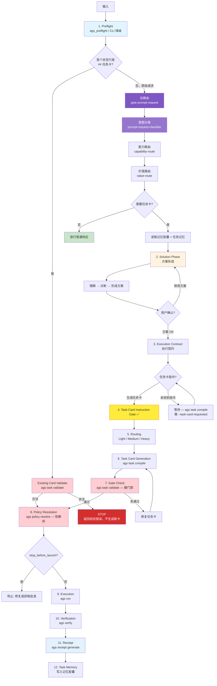

# Agent General Staff (AGS)

[](https://github.com/FernandeZ-hjm/Agent-General-Staff/actions/workflows/ci.yml)
[](LICENSE)
[](https://www.rust-lang.org/)
[]()

[中文](README.md) | [English](README.en.md)

**给一群越来越能干、越来越便宜的 AI 程序员，装一道工程安检门。**

AGS 是一套面向本地开发环境的多 Agent 工程治理内核。它用 Rust 写成单二进制（无运行时依赖），通过任务卡、执行策略、验证门禁和记忆胶囊，把 Codex、Claude Code、Cursor 等不同 AI Agent 框架纳入同一套可验证、可审计的工程秩序。

它不是又一个 Agent，也不是一堆工具的合订本。它解决的是多个 Agent 一起进真实项目时的**治理问题**：谁可以做什么，什么时候必须停，任务怎么交接，执行怎么验证，上下文怎么延续。

## 目录

- [快速开始](#快速开始)
- [60 秒演示](#60-秒演示)
- [七道闸](#七道闸)
- [怎么工作](#怎么工作)
- [常用命令](#常用命令)
- [为什么需要 AGS](#为什么需要-ags)
- [设计哲学](#设计哲学)
- [验证](#验证)
- [第三方技能](#第三方技能)
- [了解更多](#了解更多)
- [许可证](#许可证)

## 快速开始

```bash
# 前置：Rust 工具链
curl --proto '=https' --tlsv1.2 -sSf https://sh.rustup.rs | sh
source "$HOME/.cargo/env"

# 克隆 + 安装
git clone https://github.com/FernandeZ-hjm/Agent-General-Staff.git
cd Agent-General-Staff
bash scripts/install.sh
```

安装脚本会构建 `ags` 并执行 `ags setup --yes --force`，写入公开安全的本机入口和 MCP 片段。不安装第三方技能，不引入私有运行时。

安装后：

```bash
ags doctor            # 检查套件健康
ags verify --scope local   # 本地验证
```

<details>
<summary><strong>从源码构建（不用安装脚本）</strong></summary>

**Linux / macOS：**

```bash
cargo build --release
export PATH="$PWD/target/release:$PATH"
ags verify --scope local
```

**Windows（PowerShell）：**

```powershell
cargo build --release
$env:Path = "$PWD\target\release;$env:Path"
.\target\release\ags.exe verify --scope local
```

`scripts/install.sh` 和 `scripts/update.sh` 是 Bash 便捷脚本，面向 Linux / macOS / WSL / Git Bash。Windows 原生环境走上面的 Cargo + PowerShell 路径。

</details>

<details>
<summary><strong>更新 AGS</strong></summary>

```bash
# 只检查，不安装
bash scripts/update.sh --check --max-age-days 1

# 显式更新：拉取最新源码，重装，跑验证
bash scripts/update.sh --apply
```

更新后 `ags --version` 仍显示旧版本？运行 `command -v ags` 确认 shell 实际调用的是哪个二进制。安装和更新脚本会在结束时报告路径，并在旧二进制抢占 PATH 时给出修复提示。

</details>

## 60 秒演示

```bash
# 1. 项目预检：Agent 进项目前，先知道自己在哪
ags session preflight --for claude-code --target .

# 2. 套件健康诊断
ags doctor

# 3. 校验任务卡 + 解析执行策略
ags task validate examples/task-cards/medium-demo-task.md
ags policy resolve examples/task-cards/medium-demo-task.md

# 4. 结构化验证
ags verify --scope local
```

更多样例见 [examples/](examples/)，评估实验见 [evals/](evals/)。

## 七道闸

AGS 不是靠一个功能管住 Agent，而是在工程链路的七个位置各放了一道闸。每道闸解决一个被 AI 编程反复打过的具体的坑。

### 任务卡治理

任务卡不是 prompt。它是 Agent 动手前必须签的工程合同——写清目标、非目标、权限模式、执行边界、验证方式、交付格式。有合同在，Agent 就不能从用户一句话里自由发挥。

### 执行策略解析

Agent 不该自己决定能做什么。AGS 根据任务卡解析执行策略：只读、计划优先、执行并验证、还是必须先停下来等人工确认。策略先行，执行在后。

### 项目预检

Agent 进项目前先做体检。`ags session preflight` 读取项目身份、协议状态、记忆路径、停止条件、验证命令和缺口提示——不靠猜。

### 验证门禁

用验证结果说话，不接受口头"我完成了"。`ags verify` 检查格式、测试、构建、任务卡 fixture、YAML、协议状态和发布边界，结果以统一格式输出——人能看，Agent 和 CI 也能读。

### 执行回执

每次执行留一张可追溯的回执。`ags receipt` 记录任务卡、执行策略、验证结果、退出码和 review gate 状态。不是仪式——是让每次 Agent 执行都能被回看。

### 技能治理

第三方技能可以推荐，但不替你默认安装。`ags skill` 提供管理控制台：`inventory` 审计本地技能资产、`verify` 检查宿主可见性、`propose` 干跑提案、`adopt` / `ignore` 确认式写入。每次变更有记录、有确认、有边界。

`ags capability verify --host <host> --strict` 使用安装时记录的 AGS source authority
计算固定 expected 集合，不会因为从不同项目目录运行就缩小检查范围。required 第三方
父技能缺失、内部 playbook 不完整，或旧 playbook 被错误暴露为独立技能时都会 fail
closed；`ags doctor` 也会把这类宿主路由缺口列为正式失败项。

### 记忆胶囊

让经验从聊天里逃出来，变成项目资产。每次任务后，AGS 保存任务快照、关键判断、验证结果和上下文摘要。后续 Agent 进项目先读项目画像和任务记忆，不用每轮从零解释需求。项目越大、任务链越长、参与的 Agent 越多，这件事越值钱。

### 自检与发布门禁

仓库内置 `deny.toml`（RustSec 漏洞通报 + 许可证白名单 + crates.io 唯一来源），`cargo deny` 接入 CI 和 `scripts/verify.sh`，失败即关闭。`ags verify lane` 和 lane-decision helper 按 diff 风险选择 minimal / standard / full / release 验证路径，公开发布还会检查 public-full 边界，避免私有运行时、本机路径或构建产物混进发布面。

## 怎么工作

AGS 不允许 Agent 从用户的一句话直接跳到执行。任何 AGS 场景都先完成 `ags_preflight`（或 CLI 降级 preflight）；随后入口区分“已有任务卡”和“原始请求”：首个非空行是 `## 任务卡` 时必须在 raw-request classifier 之前校验，合法卡直接进入 policy / runner，非法卡 fail closed；只有原始请求才经过 `gate prompt-request` 的意图分类、能力路由和价值路由。

```text
AGS 场景输入 → preflight
  ├─ 已有 canonical 任务卡 → 先校验
  │    ├─ 合法 → 策略解析 → 执行 → 验证 → 回执 → 记忆
  │    └─ 非法 → 停止并返回校验错误，不得回落到新任务卡生成
  └─ 原始请求 → 总路由（意图分类 + 能力路由 + 价值路由）
       ├─ 需要任务卡 → 方案形成 → 编译任务卡 → 校验 → 策略解析 → 执行 → 验证 → 回执 → 记忆
       └─ 不需要任务卡 → 放行普通响应
```

从原始请求生成新任务卡时，**三段门槛**依然生效：

1. **方案 OK** — 用户确认方案方向
2. **任务卡指令** — 用户明确要求生成任务卡（"方案 OK"≠"可以开工"）
3. **任务分级路由** — Light / Medium / Heavy，决定执行策略

缺少中间的任务卡指令，不得进入路由。



架构详情见 [docs/architecture.md](docs/architecture.md)。

## 常用命令

2.7 采用总路由 + 五段链路 CLI 架构：5 个顶层命令覆盖全局治理生命周期，内核子命令处理任务卡、策略、验证和回执。

### 五段链路（全局管理）

| 段 | 命令 | 作用 |
|---|---|---|
| 1 | `ags setup` | 安装/升级本机 AGS 治理内核 |
| 2 | `ags agents` | 纳管本机 Agent 宿主（scan / govern / verify） |
| 3 | `ags skill` | 纳管本机技能本体（inventory / dedupe / verify） |
| 4 | `ags init` | 将目标项目接入 AGS 治理 |
| 5 | `ags update` | 统一更新内核 / Agent / 技能 / 项目 |

### 内核（治理闭环）

| 命令 | 作用 |
|---|---|
| `ags session preflight` | 项目预检——Agent 唤醒入口（MCP 降级路径） |
| `ags task validate` | 校验任务卡格式与语义 |
| `ags task compile` | 编译执行契约为规范任务卡 |
| `ags policy resolve` | 解析执行策略 |
| `ags policy check` | 校验 + 解析，按 gate 结果 exit |
| `ags policy explain` | 逐条输出策略规则解释 |
| `ags gate check` | Runner 级 gate 决策 |
| `ags run` | 任务卡执行管线（resolver-first） |
| `ags verify --scope local` | 结构化验证（local / full / release） |
| `ags verify lane` | 按 diff 风险分类验证路径 |
| `ags receipt verify` | 校验执行回执完整性 |
| `ags mcp serve` | 启动 AGS MCP stdio 服务 |
| `ags capability verify --host <host> --strict` | 校验必需能力、父技能及内部入口的宿主可见性 |

**Agent 入口：**`/ags` 是 Claude Code 入口，所有 AGS 任务优先通过 AGS MCP 调用 `ags_preflight`，CLI 只作为 MCP 不可用时的降级路径。完整子命令用 `ags <command> --help` 查看。

## 为什么需要 AGS

我一开始以为，AI 编程最大的问题是模型不够聪明。后来发现不是。问题是它太聪明、太勤快、太敢干。

你让它改一个函数，它顺手重构半个模块。你让它做只读审计，它看着看着就想帮你修。你说"这个方案可以"，它理解成"那我开工了"。你让它完成任务，它告诉你"完成了"——没有测试、没有证据，也没有一份能回看的记录。

这些坑后来都变成了 AGS 里的具体闸门：

| 踩过的坑 | 长出的闸门 |
|---|---|
| 只读任务被越权改代码 | 执行策略解析 + 门禁 |
| 说"完成了"却没验证 | 验证门禁 + 执行回执 |
| 换个对话就失忆，同一个坑再踩一遍 | 记忆胶囊 |
| 技能、钩子、MCP 配置互相污染 | 统一技能治理 |

往更底层看，这是个控制问题。大模型是一个高增益但会漂移的元件。工程能做的，不是造一个永不出错的模型，而是在它外面套一道回路：让它少猜一点、少自由发挥一点，多按任务卡、协议、验证和记忆来协作。模型能力会波动，工程流程负责兜底。

## 设计哲学

<details>
<summary><strong>起源：我只是想管几个插件</strong></summary>

我是个 AI 编程新手。跟很多人一样，刚上手那阵特别容易上头——社交网络上有人晒神级技能、MCP、钩子、各种配置文件，我看见就想装。今天一个代码审查插件，明天一个任务记忆系统，后天一个自动化钩子，不装好像就落后了。

插件一多，问题就来了。谁来管版本？第三方技能怎么更新，才不会破坏我本地已经跑通的环境？MCP、钩子、项目规则、智能体配置会不会互相打架？我本来只想写个小脚本，把这些本地插件管起来。一个月后，它变成了我的第一个开源项目。

后来我发现它和微软的 [AGT（Agent Governance Toolkit）](https://github.com/microsoft/agent-governance-toolkit) 撞了名。AGT 管的是 Agent 执行时的策略闸门，在工具调用、API、文件操作落地前做拦截；AGS 管的是 Agent 工程协作的整条生命周期——预检、方案、任务卡、执行策略、验证、回执、记忆。名字撞得近，但撞到了同一个时代命题：AI 程序员越来越能干，人类怎么管。

AGS 不是我拍脑袋设计出来的。它更像是我被 AI 编程连续打了几顿之后，身体自己长出来的一套防御系统。

</details>

<details>
<summary><strong>五条宪章</strong></summary>

详解见 [docs/philosophy.md](docs/philosophy.md)，这里给骨架：

| 宪章 | 一句话 | 在 AGS 里变成了 |
|---|---|---|
| 一·不迷信单一 AI | Codex、Claude Code、Cursor 都强，但强的地方不一样 | 给所有 Agent 一套共同工程秩序 |
| 二·AI 听不全人话 | 提示词是聊天语言，不是工程合同 | 任务卡才是工程合同 |
| 三·执行不是一条直线 | 它有时天才，有时走神 | 留下过程；让错误不要悄悄发生 |
| 四·高光判断该被沉淀 | 宝贵的不是模型输出，是人在方案阶段的判断 | 记忆胶囊 |
| 五·模型搭配，干活不累 | 顶级模型贵，平价模型放飞又不稳 | 顶级做判断，平价做执行，AGS 管全程 |

</details>

<details>
<summary><strong>给平价模型装一个方舟反应炉</strong></summary>

顶级模型好用但贵。平价模型便宜，完全放飞又容易不稳。AGS 做的，是给平价模型套上工程流程：明确任务、明确边界、明确验收。顶级模型负责关键判断，平价模型负责大量具体执行，AGS 管住全过程，交付后再让更强的模型查漏补缺。

单看一次输出，它不能让平价模型变成顶级模型。但在持续多轮的工程链路里，有任务卡约束、有验证门禁、有执行回执兜底的平价模型，交付稳定性远高于无约束的放飞状态。这个差距随任务链长度递增。

像给平价模型装了一个方舟反应炉：核心不大，但能让预算机体迸发出接近顶配的续航。

</details>

## 跨平台支持

AGS 在 CI 中延续 `ubuntu-latest`、`macos-latest` 和 `windows-latest` 三平台验证。

- **Rust 内核**跨三平台构建、测试、运行。`ags-platform` crate 统一处理各平台的 home 目录解析和 PATH 查找（Windows 走 `USERPROFILE` + `PATHEXT`，不依赖 Unix `$HOME` 或外部 `which`）。
- **Bash 脚本**（`scripts/*.sh`）面向 Linux / macOS / WSL / Git Bash，不承诺 Windows 原生 PowerShell / cmd 运行。

## 验证

```bash
# 本地验证：格式、测试、构建、fixture、YAML、preflight
ags verify --scope local

# 发布边界验证：公开清单完整性 + tracked 源泄露扫描 + bootstrap 产物边界
ags verify --scope release

# 兼容总闸（等价 ags verify --scope local + 命令面冒烟）
bash scripts/verify.sh
```

## 第三方技能

AGS 可以推荐第三方开发技能，但不会默认安装。

第三方技能会改变 Agent 行为，也可能影响本地开发环境。AGS 的态度是：可以推荐，可以检查，可以记录，但必须由用户显式确认。推荐列表见 `docs/skill-recommendations.md`，Superpowers 相关技能的来源和 MIT License 说明见 `THIRD_PARTY_NOTICES.md`。

## 了解更多

- [docs/philosophy.md](docs/philosophy.md) — 五条宪章详解与控制论思路
- [docs/architecture.md](docs/architecture.md) — 架构：生命周期、MCP 初始化门禁、crate 依赖图、执行链路、记忆胶囊机制
- [docs/comparison.md](docs/comparison.md) — AGS 与其他治理方案的对比
- [examples/](examples/) — 公开安全样例：demo 项目、任务卡、输出样例、合成 receipt
- [evals/](evals/) — 可复现评估实验：越权拦截、无验证交付、方案即执行
- [RELEASE_NOTES.md](RELEASE_NOTES.md) — 当前版本能力与历史发布说明
- [GitHub Releases](https://github.com/FernandeZ-hjm/Agent-General-Staff/releases) — 经 tag 触发验证后发布的正式版本
- [COMMERCIAL.md](COMMERCIAL.md) — GPL-3.0 许可证下的商业使用、署名和品牌说明

## 许可证

AGS（Agent General Staff，原名 Agent Governance Suite）使用 GNU General Public License v3.0 only (GPL-3.0-only)。

你可以下载、阅读、复制、修改和分发 AGS。**核心条件：如果你分发 AGS 或其衍生作品，接收方必须也能获得 GPL-3.0-only 下的完整源代码。** 纯内部使用不触发该义务。`NOTICE.md` 和 `THIRD_PARTY_NOTICES.md` 记录项目署名和第三方材料来源，分发时应保留。"Agent General Staff" 和 "AGS" 名称可用于真实署名和兼容性说明，不代表授予品牌背书或商标授权。

---

AGS 是给 AI 程序员装的一道安检门——不是让它更自由，而是让它进真实项目时知道边界、留下记录、接受验收，把经验带到下一次任务。
