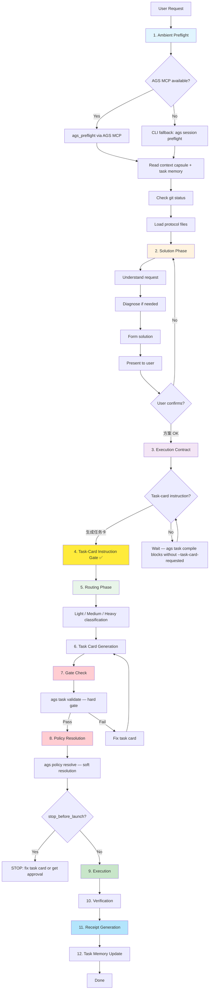
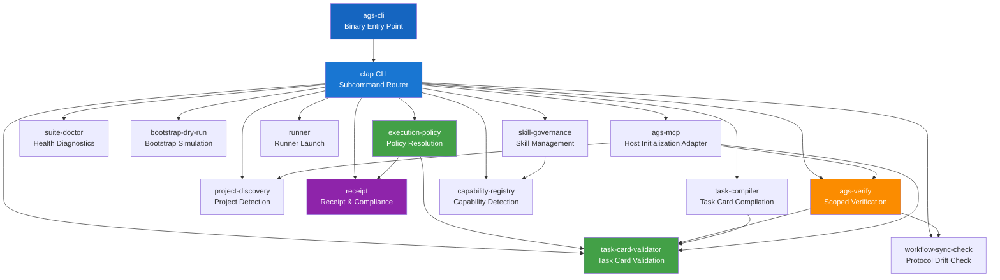
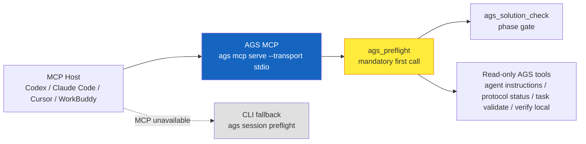
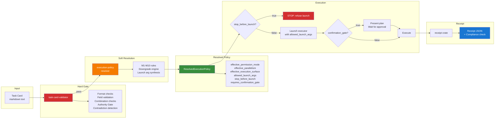

# AGS Architecture

This document describes the internal architecture of Agent General Staff 2.0
Public Edition. It covers the lifecycle phases, the Rust CLI crate dependency
graph, the AGS MCP host initialization adapter, the task-card-to-execution
pipeline, and the memory capsule mechanism.

## 1. AGS Lifecycle

The AGS governance lifecycle is a linear sequence of phases. Each phase gates
the next — no phase may be skipped or executed out of order.



**Key gates:**

| Gate | What It Blocks | Hard/Soft |
|---|---|---|
| AGS MCP initialization gate | AGS scenarios before `ags_preflight` completes | Hard, with CLI fallback only if MCP is unavailable |
| Task-card instruction gate | Routing before explicit "生成任务卡" | Hard |
| Task-card validation | Execution of invalid task cards | Hard |
| Policy resolution | Execution with wrong permission/parallelism | Soft (downgrades, never rejects) |
| Verification gate | Delivery claims without evidence | Per task card |

`ags_preflight` is the preferred kernel activation entry when AGS MCP is
available. `ags session preflight` is the equivalent CLI fallback, not the
primary path for MCP-capable hosts.

## 2. Rust CLI Crate Architecture

AGS is organized as a Rust workspace with multiple crates. Each crate has a
single responsibility.



**Crate responsibilities:**

| Crate | Responsibility | Primary consumer |
|---|---|---|
| `ags-cli` | CLI entry point, clap routing | Users, CI |
| `task-card-validator` | Canonical task-card format gate | `execution-policy`, `task-compiler`, `ags verify` |
| `execution-policy` | Resolve how a valid task card should execute (M1–M10 rules) | Runner, scripts |
| `suite-doctor` | Health diagnostics, missing-file detection | Users, preflight |
| `bootstrap-dry-run` | Simulate project bootstrap without writing | Users, `ags bootstrap` |
| `workflow-sync-check` | Multi-target protocol drift detection | `ags verify --scope full` |
| `ags-verify` | Scoped verification orchestrator (`local`/`full`/`release`) | Users, CI, preflight |
| `project-discovery` | Detect project identity and AGS integration | `ags_preflight`, `ags session preflight` |
| `receipt` | Receipt generation, verification, compliance check | Runner, verification gate |
| `task-compiler` | Compile execution contract into canonical task card | Codex, Cursor |
| `skill-governance` | Skill scan, check, propose, install, adopt, ignore | Users |
| `capability-registry` | Detect available capabilities (MCP, tools, skills) | `skill-governance` |
| `runner` | Launch executor with resolved policy | `scripts/run-task-card.sh` |
| `ags-mcp` | Expose read-only AGS governance tools/resources/prompts over stdio MCP; requires `ags_preflight` first | MCP hosts: Codex, Claude Code, Cursor, WorkBuddy |

## 3. AGS MCP Host Initialization Adapter

AGS MCP is the suite's host initialization adapter. It is not a governed
third-party MCP and should not be listed with governed external MCPs. It exposes
the AGS governance kernel over stdio so MCP-capable hosts can call
`ags_preflight` before any other AGS action.



**Boundary rules:**

- AGS MCP is the mandatory governance interface for AGS scenarios when present.
- `ags_preflight` must be the first AGS MCP tool call.
- AGS MCP does not proxy, wrap, install, or require external advisory MCPs.
  Hosts call AGS MCP and any optional advisory MCP separately when both are
  available.
- CLI preflight remains a supported fallback when the host cannot call AGS MCP.

## 4. Task-Card to Execution Pipeline

This diagram shows the data flow from a raw task card through validation, policy
resolution, and execution to the final receipt.



**The two-gate architecture:**

1. **Validator (HARD gate)**: An invalid task card must be fixed before anything
   else. The validator checks format, required fields, field values, field
   combinations, protected paths, contradictions, and the Execution Authority Gate.
   Failure is fatal — no soft recovery, no downgrade, just stop and fix.

2. **Policy resolver (SOFT gate)**: A valid task card may still need adjustment.
   The resolver applies M1–M10 rules to downgrade permission, strip forbidden
   parallelism, block background execution for read-only cards, and add
   confirmation gates. It never rejects a valid card — it adjusts launch strategy
   and records every downgrade with audit-trail entries.

**Core invariant**: Runners MUST consume `allowed_launch_args` from the resolved
policy, NOT synthesize args from raw task-card fields. This ensures the M5/M6
writability gate (read-only/plan-only cards never produce write-type launch args)
cannot be bypassed.

## 5. Memory Capsule & Task Archive Mechanism

AGS provides durable project memory through a layered mechanism that grows with
project usage. The memory system is separate from the AGS public distribution —
only blank templates are shipped; real memory is user-grown state.

```mermaid
flowchart TD
    subgraph "Stable (Manual)"
        CC[context-capsule.md<br/>Manual-maintained<br/>Project charter + stable facts]
    end

    subgraph "Task Lifecycle"
        TM[task-memory.md<br/>Auto-refreshed<br/>Latest task index]
        TA[task-archive/<br/>Per-task archives<br/>Full audit trail]
    end

    subgraph "Session Entry"
        SP[ags_preflight<br/>or CLI preflight fallback]
        SP --> CC
        SP --> TM
    end

    subgraph "Task Execution"
        TASK[Task executed]
        TASK --> DR[Delivery Report]
        TASK --> RC2[Receipt JSON]
    end

    subgraph "Auto-Archive (Stop Hook)"
        DR --> ARCHIVE[Stop hook detects<br/>delivery report + receipt]
        ARCHIVE --> TM_UPDATE[Update task-memory.md<br/>with latest task summary]
        ARCHIVE --> TA_WRITE[Write full archive to<br/>task-archive/{{timestamp}}-archive.md]
    end

    subgraph "Next Session"
        NS[Next agent session]
        NS --> SP2[ags_preflight<br/>or CLI preflight fallback]
        SP2 --> CC2[Read context-capsule.md]
        SP2 --> TM2[Read task-memory.md]
        TM2 --> TA2[Read recent task archives]
        CC2 --> RULES2[Enforce project design purpose]
    end

    style CC fill:#e8f5e9
    style TM fill:#fff3e0
    style TA fill:#fce4ec
    style ARCHIVE fill:#e3f2fd
```

**Memory layers:**

| Layer | Maintainer | Content | Lifetime |
|---|---|---|---|
| `context-capsule.md` | Human | Project charter, stable facts, design-purpose, boundaries | Persistent, only manual edits |
| `task-memory.md` | Auto (Stop hook) | Rolling index of latest tasks with archive links | Persistent, auto-refreshed |
| `task-archive/` | Auto (Stop hook) | Full per-task archives with delivery reports and receipts | Persistent, append-only |
| `progress-log.md` | Auto (context-memory.sh) | Continuous progress log | Persistent, append-only |
| Delivery report | Executor | Per-task summary of changes, verification, risks | Per task, archived |
| Receipt | Runner | Structured JSON audit trail | Per task, archived |

**Safety rules:**

- Context capsule is manual-only. Automated scripts must not overwrite it.
- Task memory is auto-refreshed but human-reviewable.
- Memory capsule state is advisory context, not proof of current repository state.
- Real memory capsules and task archives are user-grown state. The AGS public
  distribution ships only blank templates under `templates/memory/`.
- `protocol/project-profile.md` and `protocol/context-memory.md` are public-safe
  protocol skeletons, not real memory.

**Integration flow:**

```
New project
  → ags bootstrap --apply
  → creates blank templates/memory/*
  → human fills context-capsule.md
  → tasks execute, Stop hook archives results
  → task-memory.md grows
  → next agent reads capsule + memory on preflight
```
