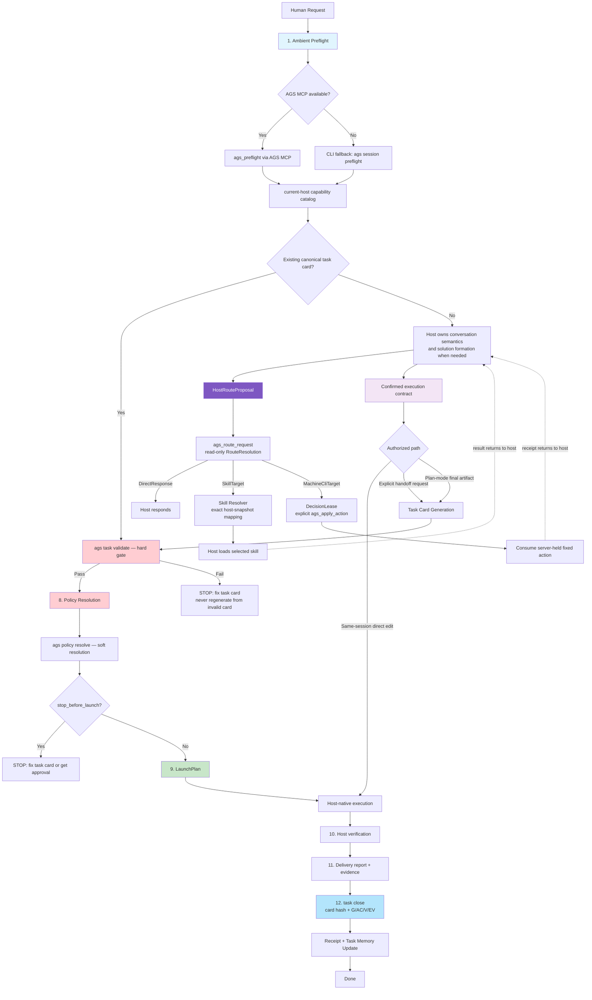
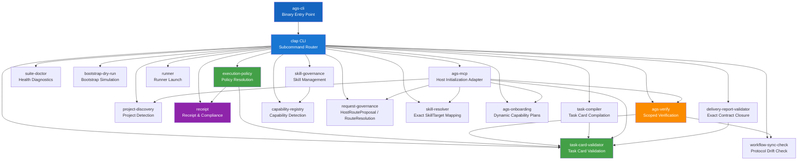
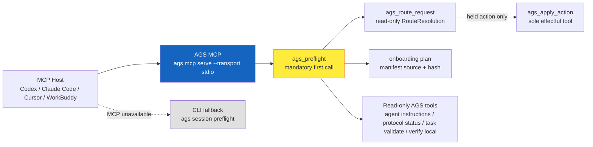
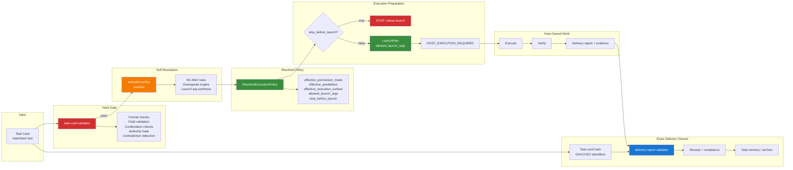
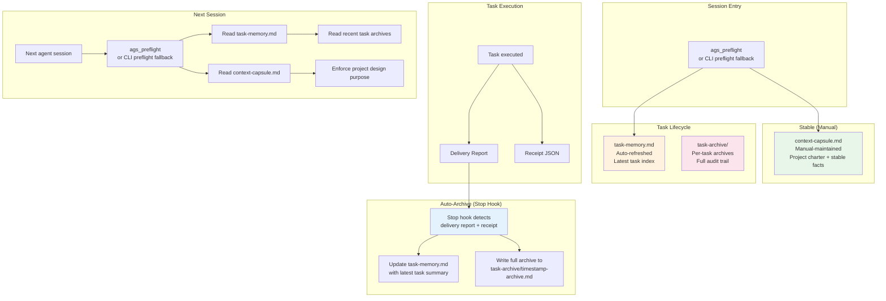

# AGS Architecture

This document describes the internal architecture of Agent General Staff 0.3
Public Edition. It covers the lifecycle phases, the Rust CLI crate dependency
graph, the AGS MCP host initialization adapter, the task-card-to-execution
pipeline, and the memory capsule mechanism.

## 1. AGS Lifecycle

AGS separates host-owned natural-language understanding from structured AGS
validation. The host owns conversation context and forms the typed proposal;
AGS never parses raw requests.


```mermaid
flowchart TD
    A[Human Request] --> B[1. Ambient Preflight]
    B --> B0{AGS MCP available?}
    B0 -->|Yes| B1[ags_preflight via AGS MCP]
    B0 -->|No| B1F[CLI fallback: ags session preflight]
    B1 --> CAT[current-host capability catalog]
    B1F --> CAT
    CAT --> EXIST{Existing canonical task card?}
    EXIST -->|Yes| J1[ags task validate — hard gate]
    EXIST -->|No| H[Host owns conversation semantics<br/>and solution formation when needed]
    H --> P[HostRouteProposal]
    P --> RD[ags_route_request<br/>read-only RouteResolution]
    RD -->|DirectResponse| DIRECT[Host responds]
    RD -->|SkillTarget| SR[Skill Resolver<br/>exact host-snapshot mapping]
    RD -->|MachineCliTarget| FIXED[DecisionLease<br/>explicit ags_apply_action]
    SR --> SKILL[Host loads selected skill]
    FIXED --> APPLY[Consume server-held fixed action]
    SKILL -. result returns to host .-> H
    APPLY -. receipt returns to host .-> H
    H --> E[Confirmed execution contract]
    E --> F{Authorized path}
    F -->|Same-session direct edit| EXEC[Host-native execution]
    F -->|Explicit handoff request| I[Task Card Generation]
    F -->|Plan-mode final artifact| I
    I --> J1
    J1 -->|Pass| K[8. Policy Resolution]
    J1 -->|Fail| J_FAIL[STOP: fix task card<br/>never regenerate from invalid card]
    K --> K1[ags policy resolve — soft resolution]
    K1 --> L{stop_before_launch?}
    L -->|Yes| L_STOP[STOP: fix task card or get approval]
    L -->|No| M[9. LaunchPlan]
    M --> EXEC
    EXEC --> N[10. Host verification]
    N --> O[11. Delivery report + evidence]
    O --> CLOSE[12. task close<br/>card hash + G/AC/V/EV]
    CLOSE --> MEM[Receipt + Task Memory Update]
    MEM --> Q[Done]

    style B fill:#e1f5fe
    style P fill:#7e57c2,color:#fff
    style E fill:#f3e5f5
    style J1 fill:#ffcdd2
    style K fill:#ffcdd2
    style M fill:#c8e6c9
    style CLOSE fill:#b3e5fc
```

**Key gates:**

| Gate | What It Blocks | Hard/Soft |
|---|---|---|
| AGS MCP initialization gate | AGS scenarios before `ags_preflight` completes | Hard, with CLI fallback only if MCP is unavailable |
| Request contract | DirectResponse is exclusive; otherwise at most one exact SkillTarget and one closed MachineCliTarget coexist | Hard |
| Task-card instruction gate | Compilation without either an explicit handoff request or a Plan-mode final artifact, plus a confirmed handoff contract | Hard |
| Task-card validation | Execution of invalid task cards | Hard |
| Policy resolution | Execution with wrong permission/parallelism | Soft (downgrades, never rejects) |
| Delivery closure | Delivery claims whose card hash or G/AC/V/EV identifier coverage does not match the canonical task card | Hard per task card |

`ags_preflight` is the preferred kernel activation entry when AGS MCP is
available. `ags session preflight` is the equivalent CLI fallback, not the
primary path for MCP-capable hosts.

## 2. Rust CLI Crate Architecture

AGS is organized as a Rust workspace with multiple crates. Each crate has a
single responsibility.


```mermaid
graph TD
    A[ags-cli<br/>Binary Entry Point] --> B[clap CLI<br/>Subcommand Router]
    B --> C1[task-card-validator<br/>Task Card Validation]
    B --> C2[execution-policy<br/>Policy Resolution]
    B --> C3[suite-doctor<br/>Health Diagnostics]
    B --> C4[bootstrap-dry-run<br/>Bootstrap Simulation]
    B --> C5[workflow-sync-check<br/>Protocol Drift Check]
    B --> C6[ags-verify<br/>Scoped Verification]
    B --> C7[project-discovery<br/>Project Detection]
    B --> C8[receipt<br/>Receipt & Compliance]
    B --> C9[task-compiler<br/>Task Card Compilation]
    B --> C10[skill-governance<br/>Skill Management]
    B --> C11[capability-registry<br/>Capability Detection]
    B --> C12[runner<br/>Runner Launch]
    B --> C13[ags-mcp<br/>Host Initialization Adapter]
    B --> C14[request-governance<br/>HostRouteProposal / RouteResolution]
    B --> C15[skill-resolver<br/>Exact SkillTarget Mapping]
    B --> C16[ags-onboarding<br/>Dynamic Capability Plans]
    B --> C17[delivery-report-validator<br/>Exact Contract Closure]

    C2 --> C1
    C2 --> C8
    C6 --> C1
    C6 --> C5
    C9 --> C1
    C10 --> C11
    C13 --> C7
    C13 --> C1
    C13 --> C6
    C13 --> C14
    C13 --> C15
    C13 --> C16
    C17 --> C1

    style A fill:#1565c0,color:#fff
    style B fill:#1976d2,color:#fff
    style C1 fill:#43a047,color:#fff
    style C2 fill:#43a047,color:#fff
    style C6 fill:#fb8c00,color:#fff
    style C8 fill:#8e24aa,color:#fff
```

**Crate responsibilities:**

| Crate | Responsibility | Primary consumer |
|---|---|---|
| `ags-cli` | CLI entry point, clap routing | Users, CI |
| `task-card-validator` | Canonical task-card format gate | `execution-policy`, `task-compiler`, `ags verify` |
| `execution-policy` | Resolve how a valid task card should execute (M1–M10 rules) | Runner, scripts |
| `suite-doctor` | Health diagnostics, missing-file detection | Users, preflight |
| `bootstrap-dry-run` | Simulate project bootstrap without writing | Users, `ags bootstrap` |
| `workflow-sync-check` | Multi-target protocol drift detection | `ags verify --scope full` |
| `ags-verify` | Scoped verification orchestrator (`local`/`full`/`release`) | Users, CI, preflight |
| `project-discovery` | Detect project identity and AGS integration | `ags_preflight`, `ags session preflight` |
| `receipt` | Receipt generation, verification, compliance check | Runner, verification gate |
| `task-compiler` | Compile execution contract into canonical task card | Codex, Cursor |
| `skill-governance` | Skill scan, check, propose, install, adopt, ignore | Users |
| `capability-registry` | Detect available capabilities (MCP, tools, skills) | `skill-governance` |
| `runner` | Prepare a validated LaunchPlan; never executes the host action | `scripts/run-task-card.sh` |
| `ags-mcp` | Expose read-only AGS governance tools/resources/prompts over stdio MCP; requires `ags_preflight` first | MCP hosts: Codex, Claude Code, Cursor, WorkBuddy |
| `request-governance` | Define and validate typed HostRouteProposal / RouteResolution contracts | `ags-mcp`, `ags-cli` |
| `skill-resolver` | Resolve an exact SkillTarget against a validated host snapshot without language parsing or fallback | `ags-mcp`, `ags-cli` |
| `ags-onboarding` | Fetch and hash the public capability manifest, probe the active machine/project, and emit a deterministic reviewed action plan | `ags-mcp`, `ags-cli` |
| `delivery-report-validator` | Bind a delivery report to the exact task-card hash and close every G/AC/V/EV identifier | `ags-cli` |

## 3. AGS MCP Host Initialization Adapter

AGS MCP is the suite's host initialization adapter. It is not a governed
third-party MCP and should not be listed with governed external MCPs. It exposes
the AGS governance kernel over stdio so MCP-capable hosts can call
`ags_preflight` before any other AGS action.


```mermaid
flowchart LR
    HOST[MCP Host<br/>Codex / Claude Code / Cursor / WorkBuddy]
    AGSMCP[AGS MCP<br/>ags mcp serve --transport stdio]
    PREFLIGHT[ags_preflight<br/>mandatory first call]
    ROUTE[ags_route_request<br/>read-only RouteResolution]
    APPLY[ags_apply_action<br/>sole effectful tool]
    ONBOARD[onboarding plan<br/>manifest source + hash]
    TOOLS[Read-only AGS tools<br/>agent instructions / protocol status / task validate / verify local]
    CLI[CLI fallback<br/>ags session preflight]

    HOST --> AGSMCP
    AGSMCP --> PREFLIGHT
    PREFLIGHT --> ROUTE
    PREFLIGHT --> ONBOARD
    PREFLIGHT --> TOOLS
    ROUTE -->|held action only| APPLY
    HOST -. MCP unavailable .-> CLI

    style AGSMCP fill:#1565c0,color:#fff
    style PREFLIGHT fill:#ffeb3b,stroke:#f57f17
    style CLI fill:#e0e0e0
```

**Boundary rules:**

- AGS MCP is the mandatory governance interface for AGS scenarios when present.
- `ags_preflight` must be the first AGS MCP tool call.
- The host submits `HostRouteProposal`; AGS does not accept raw request text.
- `ags_apply_action` is the sole effectful MCP tool and consumes only a held action.
- AGS MCP does not proxy, wrap, install, or require external advisory MCPs.
  Hosts call AGS MCP and any optional advisory MCP separately when both are
  available.
- CLI preflight remains a supported fallback when the host cannot call AGS MCP.

## 4. Task-Card to Execution Pipeline

This diagram shows the data flow from a canonical task card through validation
and policy resolution to a LaunchPlan, then through host-owned execution and
exact delivery closure. The runner never claims that it executed the host
action.


```mermaid
flowchart LR
    subgraph Input
        TC[Task Card<br/>markdown text]
    end

    subgraph Validation["Hard Gate"]
        V[task-card-validator]
        VF[Format checks<br/>Field validation<br/>Combination checks<br/>Authority Gate<br/>Contradiction detection]
        TC --> V
        V --> VF
    end

    subgraph Resolution["Soft Resolution"]
        PR[execution-policy<br/>resolver]
        RULES[M1-M10 rules<br/>Downgrade engine<br/>Launch arg synthesis]
        V -->|pass| PR
        PR --> RULES
    end

    subgraph Policy["Resolved Policy"]
        RP[ResolvedExecutionPolicy]
        RULES --> RP
        RP --> RP_FIELDS["effective_permission_mode<br/>effective_parallelism<br/>effective_execution_surface<br/>allowed_launch_args<br/>stop_before_launch"]
    end

    subgraph Prepare["Execution Preparation"]
        RUN{stop_before_launch?}
        RP --> RUN
        RUN -->|true| STOP[STOP: refuse launch]
        RUN -->|false| LAUNCH[LaunchPlan<br/>allowed_launch_args]
        LAUNCH --> REQUIRED[HOST_EXECUTION_REQUIRED]
    end

    subgraph Host["Host-Owned Work"]
        REQUIRED --> EXEC[Execute]
        EXEC --> VERIFY[Verify]
        VERIFY --> REPORT[Delivery report + evidence]
    end

    subgraph Closure["Exact Delivery Closure"]
        REPORT --> CLOSE[delivery-report-validator]
        TC --> HASH[Task card hash<br/>G/AC/V/EV identifiers]
        HASH --> CLOSE
        CLOSE --> RC[Receipt + compliance]
        RC --> RCOUT[Task memory / archive]
    end

    style V fill:#d32f2f,color:#fff
    style PR fill:#f57c00,color:#fff
    style RP fill:#388e3c,color:#fff
    style STOP fill:#d32f2f,color:#fff
    style LAUNCH fill:#388e3c,color:#fff
    style CLOSE fill:#1976d2,color:#fff
```

**The two-gate architecture:**

1. **Validator (HARD gate)**: An invalid task card must be fixed before anything
   else. The validator checks format, required fields, field values, field
   combinations, protected paths, contradictions, and the Execution Authority Gate.
   Failure is fatal — no soft recovery, no downgrade, just stop and fix.

2. **Policy resolver (SOFT gate)**: A valid task card may still need adjustment.
   The resolver applies M1–M10 rules, preserves the binary permission model
   (`plan-only` / `execute-and-verify`), strips forbidden parallelism, and
   records every downgrade with audit-trail entries. `plan-only` never launches
   a writer; `execute-and-verify` executes directly. Heavy adds an independent
   review gate, not an extra planning or confirmation round.

**Core invariant**: Runners MUST consume `allowed_launch_args` from the resolved
policy, NOT synthesize args from raw task-card fields. This ensures the M5/M6
writability gate (`plan-only` cards never produce write-type launch args)
cannot be bypassed.

## 5. Memory Capsule & Task Archive Mechanism

AGS provides durable project memory through a layered mechanism that grows with
project usage. The memory system is separate from the AGS public distribution —
only blank templates are shipped; real memory is user-grown state.


```mermaid
flowchart TD
    subgraph "Stable (Manual)"
        CC[context-capsule.md<br/>Manual-maintained<br/>Project charter + stable facts]
    end

    subgraph "Task Lifecycle"
        TM[task-memory.md<br/>Auto-refreshed<br/>Latest task index]
        TA[task-archive/<br/>Per-task archives<br/>Full audit trail]
    end

    subgraph "Session Entry"
        SP[ags_preflight<br/>or CLI preflight fallback]
        SP --> CC
        SP --> TM
    end

    subgraph "Task Execution"
        TASK[Task executed]
        TASK --> DR[Delivery Report]
        TASK --> RC2[Receipt JSON]
    end

    subgraph "Auto-Archive (Stop Hook)"
        DR --> ARCHIVE[Stop hook detects<br/>delivery report + receipt]
        ARCHIVE --> TM_UPDATE[Update task-memory.md<br/>with latest task summary]
        ARCHIVE --> TA_WRITE[Write full archive to<br/>task-archive/timestamp-archive.md]
    end

    subgraph "Next Session"
        NS[Next agent session]
        NS --> SP2[ags_preflight<br/>or CLI preflight fallback]
        SP2 --> CC2[Read context-capsule.md]
        SP2 --> TM2[Read task-memory.md]
        TM2 --> TA2[Read recent task archives]
        CC2 --> RULES2[Enforce project design purpose]
    end

    style CC fill:#e8f5e9
    style TM fill:#fff3e0
    style TA fill:#fce4ec
    style ARCHIVE fill:#e3f2fd
```

**Memory layers:**

| Layer | Maintainer | Content | Lifetime |
|---|---|---|---|
| `context-capsule.md` | Human | Project charter, stable facts, design-purpose, boundaries | Persistent, only manual edits |
| `task-memory.md` | Auto (Stop hook) | Rolling index of latest tasks with archive links | Persistent, auto-refreshed |
| `task-archive/` | Auto (Stop hook) | Full per-task archives with delivery reports and receipts | Persistent, append-only |
| `progress-log.md` | Auto (context-memory.sh) | Continuous progress log | Persistent, append-only |
| Delivery report | Executor | Per-task summary of changes, verification, risks | Per task, archived |
| Receipt | Runner | Structured JSON audit trail | Per task, archived |

**Safety rules:**

- Context capsule is manual-only. Automated scripts must not overwrite it.
- Task memory is auto-refreshed but human-reviewable.
- Memory capsule state is advisory context, not proof of current repository state.
- Real memory capsules and task archives are user-grown state. The AGS public
  distribution ships only blank templates under `templates/memory/`.
- `protocol/project-profile.md` and `protocol/context-memory.md` are public-safe
  protocol skeletons, not real memory.

**Integration flow:**

```
New project
  → ags bootstrap --apply
  → creates blank templates/memory/*
  → human fills context-capsule.md
  → tasks execute, Stop hook archives results
  → task-memory.md grows
  → next agent reads capsule + memory on preflight
```
